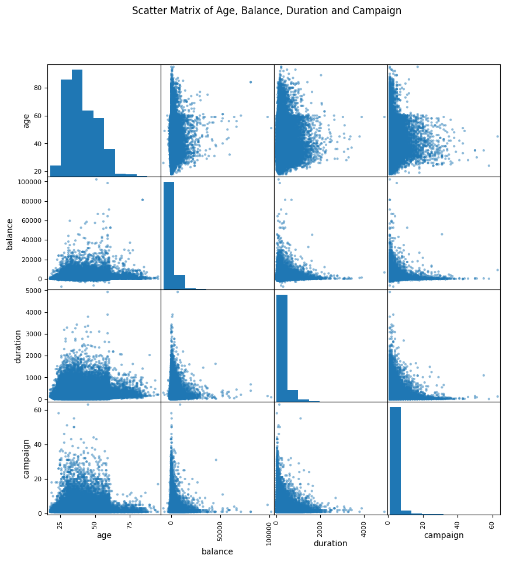

### Bank Telemarketing Impact Analysis and Prediction 


NAME: Michael H Bitar

DATE: Sep 5, 2022 / r0.3 

EMAIL: seeds.swipes.0t@icloud.com

PROJECT: Develop a machine learning solution to assist marketing executives at a client bank to understand which characteristics of potential customers are the best predictors of purchasing of one of the bank’s products. The client bank is interested in using a predictive model to score each potential customer’s propensity to purchase, as well as understand which customer characteristics are most important in driving purchasing behavior, in order to inform future marketing segmentation personalization.

METHODOLOGY: The provided dataset is imbalanced. I will be using various under/over sampling methodology to search for the best F1 Score. 

RESULTS: Oversampling the minority class provided the highest F1 Score for both classes in target y. 

REFERENCES: Content of this guide is based on authors listed in the references section at the end of this notebook. Thanks to all the authors for their valuable educational contributions. 


```python
# Import needed packages

import numpy as np
import pandas as pd
import tensorflow as tf
import sklearn as sk

from sklearn.preprocessing import MinMaxScaler
from sklearn.model_selection import train_test_split
from sklearn.metrics import confusion_matrix , classification_report

import matplotlib.pyplot as plt
import seaborn as sns

from pandas.plotting import scatter_matrix
from pandas_profiling import ProfileReport

# set random seeds for reproducability 
tf.random.set_seed(100)
seed = 15

# disable warning messages when possible
import warnings
warnings.filterwarnings('ignore')

# display all dataframe columns
pd.set_option('display.max_columns', None)

# suppress sci notation for readability
np.set_printoptions(suppress=True)

# Make numpy values easier to read
np.set_printoptions(precision=3, suppress=True)

tf.keras.layers.Normalization 
from tensorflow.keras import layers
from tensorflow import keras
from tensorflow_addons import losses

```

```python
# load dataset over the web

url = "https://raw.githubusercontent.com/scriptbuzz/datasets/main/bank-full.csv"
df = pd.read_csv(url,sep=";",error_bad_lines=False, engine ='python')
df.info()
```

    <class 'pandas.core.frame.DataFrame'>
    RangeIndex: 45211 entries, 0 to 45210
    Data columns (total 17 columns):
     #   Column     Non-Null Count  Dtype 
    ---  ------     --------------  ----- 
     0   age        45211 non-null  int64 
     1   job        45211 non-null  object
     2   marital    45211 non-null  object
     3   education  45211 non-null  object
     4   default    45211 non-null  object
     5   balance    45211 non-null  int64 
     6   housing    45211 non-null  object
     7   loan       45211 non-null  object
     8   contact    45211 non-null  object
     9   day        45211 non-null  int64 
     10  month      45211 non-null  object
     11  duration   45211 non-null  int64 
     12  campaign   45211 non-null  int64 
     13  pdays      45211 non-null  int64 
     14  previous   45211 non-null  int64 
     15  poutcome   45211 non-null  object
     16  y          45211 non-null  object
    dtypes: int64(7), object(10)
    memory usage: 5.9+ MB


```python
# # Profile the dataset 
# profile = ProfileReport(df, title="Pandas Profiling Report")
# profile
```


```python
# Generate scatter diagrams

scatter = scatter_matrix(df[['age','balance','duration','campaign']],figsize=(10,10))
plt.suptitle('Scatter Matrix of Age, Balance, Duration and Campaign')
plt.show()
```


    
```python
# show any duplicates rows in dataframe
df.duplicated().sum()
```

    0
    
    
```python
# show columns and their  uique values 
def print_unique_col_values(df):
       for column in df:
            if df[column].dtypes=='object':
                print(f'{column}: {df[column].unique()}') 

```

```python
print_unique_col_values(df)
```

    job: ['management' 'technician' 'entrepreneur' 'blue-collar' 'unknown'
     'retired' 'admin.' 'services' 'self-employed' 'unemployed' 'housemaid'
     'student']
    marital: ['married' 'single' 'divorced']
    education: ['tertiary' 'secondary' 'unknown' 'primary']
    default: ['no' 'yes']
    housing: ['yes' 'no']
    loan: ['no' 'yes']
    contact: ['unknown' 'cellular' 'telephone']
    month: ['may' 'jun' 'jul' 'aug' 'oct' 'nov' 'dec' 'jan' 'feb' 'mar' 'apr' 'sep']
    poutcome: ['unknown' 'failure' 'other' 'success']
    y: ['no' 'yes']


```python
# check value for uniquness of target label
df['y'].unique()
```

    array(['no', 'yes'], dtype=object)


```python
# count each unique value for target label. 
# We can see an imbalance in favor of "no" values for the traget label

df.y.value_counts()
```

    no     39922
    yes     5289
    Name: y, dtype: int64


```python
# apply nominal one-hot encoding to select columns
df = pd.get_dummies(data=df, columns=['job','education','marital','month','poutcome','contact'])
df.columns
```

    Index(['age', 'default', 'balance', 'housing', 'loan', 'day', 'duration',
           'campaign', 'pdays', 'previous', 'y', 'job_admin.', 'job_blue-collar',
           'job_entrepreneur', 'job_housemaid', 'job_management', 'job_retired',
           'job_self-employed', 'job_services', 'job_student', 'job_technician',
           'job_unemployed', 'job_unknown', 'education_primary',
           'education_secondary', 'education_tertiary', 'education_unknown',
           'marital_divorced', 'marital_married', 'marital_single', 'month_apr',
           'month_aug', 'month_dec', 'month_feb', 'month_jan', 'month_jul',
           'month_jun', 'month_mar', 'month_may', 'month_nov', 'month_oct',
           'month_sep', 'poutcome_failure', 'poutcome_other', 'poutcome_success',
           'poutcome_unknown', 'contact_cellular', 'contact_telephone',
           'contact_unknown'],
          dtype='object')


```python
df.info()
```

    <class 'pandas.core.frame.DataFrame'>
    RangeIndex: 45211 entries, 0 to 45210
    Data columns (total 49 columns):
     #   Column               Non-Null Count  Dtype 
    ---  ------               --------------  ----- 
     0   age                  45211 non-null  int64 
     1   default              45211 non-null  object
     2   balance              45211 non-null  int64 
     3   housing              45211 non-null  object
     4   loan                 45211 non-null  object
     5   day                  45211 non-null  int64 
     6   duration             45211 non-null  int64 
     7   campaign             45211 non-null  int64 
     8   pdays                45211 non-null  int64 
     9   previous             45211 non-null  int64 
     10  y                    45211 non-null  object
     11  job_admin.           45211 non-null  uint8 
     12  job_blue-collar      45211 non-null  uint8 
     13  job_entrepreneur     45211 non-null  uint8 
     14  job_housemaid        45211 non-null  uint8 
     15  job_management       45211 non-null  uint8 
     16  job_retired          45211 non-null  uint8 
     17  job_self-employed    45211 non-null  uint8 
     18  job_services         45211 non-null  uint8 
     19  job_student          45211 non-null  uint8 
     20  job_technician       45211 non-null  uint8 
     21  job_unemployed       45211 non-null  uint8 
     22  job_unknown          45211 non-null  uint8 
     23  education_primary    45211 non-null  uint8 
     24  education_secondary  45211 non-null  uint8 
     25  education_tertiary   45211 non-null  uint8 
     26  education_unknown    45211 non-null  uint8 
     27  marital_divorced     45211 non-null  uint8 
     28  marital_married      45211 non-null  uint8 
     29  marital_single       45211 non-null  uint8 
     30  month_apr            45211 non-null  uint8 
     31  month_aug            45211 non-null  uint8 
     32  month_dec            45211 non-null  uint8 
     33  month_feb            45211 non-null  uint8 
     34  month_jan            45211 non-null  uint8 
     35  month_jul            45211 non-null  uint8 
     36  month_jun            45211 non-null  uint8 
     37  month_mar            45211 non-null  uint8 
     38  month_may            45211 non-null  uint8 
     39  month_nov            45211 non-null  uint8 
     40  month_oct            45211 non-null  uint8 
     41  month_sep            45211 non-null  uint8 
     42  poutcome_failure     45211 non-null  uint8 
     43  poutcome_other       45211 non-null  uint8 
     44  poutcome_success     45211 non-null  uint8 
     45  poutcome_unknown     45211 non-null  uint8 
     46  contact_cellular     45211 non-null  uint8 
     47  contact_telephone    45211 non-null  uint8 
     48  contact_unknown      45211 non-null  uint8 
    dtypes: int64(7), object(4), uint8(38)
    memory usage: 5.4+ MB


```python
# apply binary encoding to select columns

df['housing'] = df['housing'].map({'yes': 1, 'no': 0})
df['loan'] = df['loan'].map({'yes': 1, 'no': 0})
df['default'] = df['default'].map({'yes': 1, 'no': 0})
df['y'] = df['y'].map({'yes': 1, 'no': 0})
```

```python
df.sample(20)
```

<div>

<table border="1" class="dataframe">
  <thead>
    <tr style="text-align: right;">
      <th></th>
      <th>age</th>
      <th>default</th>
      <th>balance</th>
      <th>housing</th>
      <th>loan</th>
      <th>day</th>
      <th>duration</th>
      <th>campaign</th>
      <th>pdays</th>
      <th>previous</th>
      <th>y</th>
      <th>job_admin.</th>
      <th>job_blue-collar</th>
      <th>job_entrepreneur</th>
      <th>job_housemaid</th>
      <th>job_management</th>
      <th>job_retired</th>
      <th>job_self-employed</th>
      <th>job_services</th>
      <th>job_student</th>
      <th>job_technician</th>
      <th>job_unemployed</th>
      <th>job_unknown</th>
      <th>education_primary</th>
      <th>education_secondary</th>
      <th>education_tertiary</th>
      <th>education_unknown</th>
      <th>marital_divorced</th>
      <th>marital_married</th>
      <th>marital_single</th>
      <th>month_apr</th>
      <th>month_aug</th>
      <th>month_dec</th>
      <th>month_feb</th>
      <th>month_jan</th>
      <th>month_jul</th>
      <th>month_jun</th>
      <th>month_mar</th>
      <th>month_may</th>
      <th>month_nov</th>
      <th>month_oct</th>
      <th>month_sep</th>
      <th>poutcome_failure</th>
      <th>poutcome_other</th>
      <th>poutcome_success</th>
      <th>poutcome_unknown</th>
      <th>contact_cellular</th>
      <th>contact_telephone</th>
      <th>contact_unknown</th>
    </tr>
  </thead>
  <tbody>
    <tr>
      <th>19134</th>
      <td>38</td>
      <td>0</td>
      <td>202</td>
      <td>0</td>
      <td>0</td>
      <td>5</td>
      <td>1311</td>
      <td>2</td>
      <td>-1</td>
      <td>0</td>
      <td>1</td>
      <td>0</td>
      <td>0</td>
      <td>0</td>
      <td>0</td>
      <td>0</td>
      <td>0</td>
      <td>0</td>
      <td>0</td>
      <td>0</td>
      <td>1</td>
      <td>0</td>
      <td>0</td>
      <td>0</td>
      <td>0</td>
      <td>1</td>
      <td>0</td>
      <td>0</td>
      <td>1</td>
      <td>0</td>
      <td>0</td>
      <td>1</td>
      <td>0</td>
      <td>0</td>
      <td>0</td>
      <td>0</td>
      <td>0</td>
      <td>0</td>
      <td>0</td>
      <td>0</td>
      <td>0</td>
      <td>0</td>
      <td>0</td>
      <td>0</td>
      <td>0</td>
      <td>1</td>
      <td>1</td>
      <td>0</td>
      <td>0</td>
    </tr>
    <tr>
      <th>2906</th>
      <td>49</td>
      <td>0</td>
      <td>387</td>
      <td>1</td>
      <td>0</td>
      <td>14</td>
      <td>347</td>
      <td>1</td>
      <td>-1</td>
      <td>0</td>
      <td>0</td>
      <td>1</td>
      <td>0</td>
      <td>0</td>
      <td>0</td>
      <td>0</td>
      <td>0</td>
      <td>0</td>
      <td>0</td>
      <td>0</td>
      <td>0</td>
      <td>0</td>
      <td>0</td>
      <td>0</td>
      <td>1</td>
      <td>0</td>
      <td>0</td>
      <td>0</td>
      <td>1</td>
      <td>0</td>
      <td>0</td>
      <td>0</td>
      <td>0</td>
      <td>0</td>
      <td>0</td>
      <td>0</td>
      <td>0</td>
      <td>0</td>
      <td>1</td>
      <td>0</td>
      <td>0</td>
      <td>0</td>
      <td>0</td>
      <td>0</td>
      <td>0</td>
      <td>1</td>
      <td>0</td>
      <td>0</td>
      <td>1</td>
    </tr>
    <tr>
      <th>6083</th>
      <td>51</td>
      <td>0</td>
      <td>51</td>
      <td>0</td>
      <td>0</td>
      <td>27</td>
      <td>121</td>
      <td>2</td>
      <td>-1</td>
      <td>0</td>
      <td>0</td>
      <td>0</td>
      <td>1</td>
      <td>0</td>
      <td>0</td>
      <td>0</td>
      <td>0</td>
      <td>0</td>
      <td>0</td>
      <td>0</td>
      <td>0</td>
      <td>0</td>
      <td>0</td>
      <td>1</td>
      <td>0</td>
      <td>0</td>
      <td>0</td>
      <td>0</td>
      <td>1</td>
      <td>0</td>
      <td>0</td>
      <td>0</td>
      <td>0</td>
      <td>0</td>
      <td>0</td>
      <td>0</td>
      <td>0</td>
      <td>0</td>
      <td>1</td>
      <td>0</td>
      <td>0</td>
      <td>0</td>
      <td>0</td>
      <td>0</td>
      <td>0</td>
      <td>1</td>
      <td>0</td>
      <td>0</td>
      <td>1</td>
    </tr>
    <tr>
      <th>22974</th>
      <td>52</td>
      <td>0</td>
      <td>60</td>
      <td>0</td>
      <td>1</td>
      <td>26</td>
      <td>196</td>
      <td>2</td>
      <td>-1</td>
      <td>0</td>
      <td>0</td>
      <td>0</td>
      <td>1</td>
      <td>0</td>
      <td>0</td>
      <td>0</td>
      <td>0</td>
      <td>0</td>
      <td>0</td>
      <td>0</td>
      <td>0</td>
      <td>0</td>
      <td>0</td>
      <td>0</td>
      <td>1</td>
      <td>0</td>
      <td>0</td>
      <td>0</td>
      <td>1</td>
      <td>0</td>
      <td>0</td>
      <td>1</td>
      <td>0</td>
      <td>0</td>
      <td>0</td>
      <td>0</td>
      <td>0</td>
      <td>0</td>
      <td>0</td>
      <td>0</td>
      <td>0</td>
      <td>0</td>
      <td>0</td>
      <td>0</td>
      <td>0</td>
      <td>1</td>
      <td>1</td>
      <td>0</td>
      <td>0</td>
    </tr>
    <tr>
      <th>21472</th>
      <td>58</td>
      <td>0</td>
      <td>2180</td>
      <td>0</td>
      <td>0</td>
      <td>18</td>
      <td>273</td>
      <td>4</td>
      <td>-1</td>
      <td>0</td>
      <td>0</td>
      <td>1</td>
      <td>0</td>
      <td>0</td>
      <td>0</td>
      <td>0</td>
      <td>0</td>
      <td>0</td>
      <td>0</td>
      <td>0</td>
      <td>0</td>
      <td>0</td>
      <td>0</td>
      <td>0</td>
      <td>0</td>
      <td>0</td>
      <td>1</td>
      <td>0</td>
      <td>1</td>
      <td>0</td>
      <td>0</td>
      <td>1</td>
      <td>0</td>
      <td>0</td>
      <td>0</td>
      <td>0</td>
      <td>0</td>
      <td>0</td>
      <td>0</td>
      <td>0</td>
      <td>0</td>
      <td>0</td>
      <td>0</td>
      <td>0</td>
      <td>0</td>
      <td>1</td>
      <td>1</td>
      <td>0</td>
      <td>0</td>
    </tr>
    <tr>
      <th>12657</th>
      <td>27</td>
      <td>0</td>
      <td>35</td>
      <td>0</td>
      <td>0</td>
      <td>4</td>
      <td>255</td>
      <td>1</td>
      <td>-1</td>
      <td>0</td>
      <td>0</td>
      <td>0</td>
      <td>0</td>
      <td>0</td>
      <td>0</td>
      <td>1</td>
      <td>0</td>
      <td>0</td>
      <td>0</td>
      <td>0</td>
      <td>0</td>
      <td>0</td>
      <td>0</td>
      <td>0</td>
      <td>1</td>
      <td>0</td>
      <td>0</td>
      <td>0</td>
      <td>0</td>
      <td>1</td>
      <td>0</td>
      <td>0</td>
      <td>0</td>
      <td>0</td>
      <td>0</td>
      <td>1</td>
      <td>0</td>
      <td>0</td>
      <td>0</td>
      <td>0</td>
      <td>0</td>
      <td>0</td>
      <td>0</td>
      <td>0</td>
      <td>0</td>
      <td>1</td>
      <td>1</td>
      <td>0</td>
      <td>0</td>
    </tr>
    <tr>
      <th>34582</th>
      <td>39</td>
      <td>0</td>
      <td>782</td>
      <td>1</td>
      <td>0</td>
      <td>5</td>
      <td>542</td>
      <td>4</td>
      <td>47</td>
      <td>11</td>
      <td>0</td>
      <td>1</td>
      <td>0</td>
      <td>0</td>
      <td>0</td>
      <td>0</td>
      <td>0</td>
      <td>0</td>
      <td>0</td>
      <td>0</td>
      <td>0</td>
      <td>0</td>
      <td>0</td>
      <td>0</td>
      <td>1</td>
      <td>0</td>
      <td>0</td>
      <td>0</td>
      <td>0</td>
      <td>1</td>
      <td>0</td>
      <td>0</td>
      <td>0</td>
      <td>0</td>
      <td>0</td>
      <td>0</td>
      <td>0</td>
      <td>0</td>
      <td>1</td>
      <td>0</td>
      <td>0</td>
      <td>0</td>
      <td>0</td>
      <td>1</td>
      <td>0</td>
      <td>0</td>
      <td>1</td>
      <td>0</td>
      <td>0</td>
    </tr>
    <tr>
      <th>10749</th>
      <td>56</td>
      <td>0</td>
      <td>21664</td>
      <td>0</td>
      <td>0</td>
      <td>17</td>
      <td>214</td>
      <td>8</td>
      <td>-1</td>
      <td>0</td>
      <td>0</td>
      <td>0</td>
      <td>0</td>
      <td>0</td>
      <td>0</td>
      <td>1</td>
      <td>0</td>
      <td>0</td>
      <td>0</td>
      <td>0</td>
      <td>0</td>
      <td>0</td>
      <td>0</td>
      <td>0</td>
      <td>0</td>
      <td>1</td>
      <td>0</td>
      <td>0</td>
      <td>1</td>
      <td>0</td>
      <td>0</td>
      <td>0</td>
      <td>0</td>
      <td>0</td>
      <td>0</td>
      <td>0</td>
      <td>1</td>
      <td>0</td>
      <td>0</td>
      <td>0</td>
      <td>0</td>
      <td>0</td>
      <td>0</td>
      <td>0</td>
      <td>0</td>
      <td>1</td>
      <td>0</td>
      <td>0</td>
      <td>1</td>
    </tr>
    <tr>
      <th>41068</th>
      <td>26</td>
      <td>0</td>
      <td>535</td>
      <td>0</td>
      <td>0</td>
      <td>14</td>
      <td>125</td>
      <td>1</td>
      <td>-1</td>
      <td>0</td>
      <td>1</td>
      <td>0</td>
      <td>1</td>
      <td>0</td>
      <td>0</td>
      <td>0</td>
      <td>0</td>
      <td>0</td>
      <td>0</td>
      <td>0</td>
      <td>0</td>
      <td>0</td>
      <td>0</td>
      <td>0</td>
      <td>1</td>
      <td>0</td>
      <td>0</td>
      <td>0</td>
      <td>0</td>
      <td>1</td>
      <td>0</td>
      <td>1</td>
      <td>0</td>
      <td>0</td>
      <td>0</td>
      <td>0</td>
      <td>0</td>
      <td>0</td>
      <td>0</td>
      <td>0</td>
      <td>0</td>
      <td>0</td>
      <td>0</td>
      <td>0</td>
      <td>0</td>
      <td>1</td>
      <td>1</td>
      <td>0</td>
      <td>0</td>
    </tr>
    <tr>
      <th>5847</th>
      <td>31</td>
      <td>0</td>
      <td>-452</td>
      <td>1</td>
      <td>0</td>
      <td>26</td>
      <td>182</td>
      <td>5</td>
      <td>-1</td>
      <td>0</td>
      <td>0</td>
      <td>0</td>
      <td>1</td>
      <td>0</td>
      <td>0</td>
      <td>0</td>
      <td>0</td>
      <td>0</td>
      <td>0</td>
      <td>0</td>
      <td>0</td>
      <td>0</td>
      <td>0</td>
      <td>0</td>
      <td>1</td>
      <td>0</td>
      <td>0</td>
      <td>1</td>
      <td>0</td>
      <td>0</td>
      <td>0</td>
      <td>0</td>
      <td>0</td>
      <td>0</td>
      <td>0</td>
      <td>0</td>
      <td>0</td>
      <td>0</td>
      <td>1</td>
      <td>0</td>
      <td>0</td>
      <td>0</td>
      <td>0</td>
      <td>0</td>
      <td>0</td>
      <td>1</td>
      <td>0</td>
      <td>0</td>
      <td>1</td>
    </tr>
    <tr>
      <th>32866</th>
      <td>35</td>
      <td>0</td>
      <td>520</td>
      <td>1</td>
      <td>0</td>
      <td>17</td>
      <td>476</td>
      <td>1</td>
      <td>-1</td>
      <td>0</td>
      <td>1</td>
      <td>0</td>
      <td>1</td>
      <td>0</td>
      <td>0</td>
      <td>0</td>
      <td>0</td>
      <td>0</td>
      <td>0</td>
      <td>0</td>
      <td>0</td>
      <td>0</td>
      <td>0</td>
      <td>0</td>
      <td>0</td>
      <td>0</td>
      <td>1</td>
      <td>0</td>
      <td>1</td>
      <td>0</td>
      <td>1</td>
      <td>0</td>
      <td>0</td>
      <td>0</td>
      <td>0</td>
      <td>0</td>
      <td>0</td>
      <td>0</td>
      <td>0</td>
      <td>0</td>
      <td>0</td>
      <td>0</td>
      <td>0</td>
      <td>0</td>
      <td>0</td>
      <td>1</td>
      <td>1</td>
      <td>0</td>
      <td>0</td>
    </tr>
    <tr>
      <th>39582</th>
      <td>34</td>
      <td>0</td>
      <td>23076</td>
      <td>0</td>
      <td>0</td>
      <td>26</td>
      <td>243</td>
      <td>2</td>
      <td>35</td>
      <td>6</td>
      <td>1</td>
      <td>0</td>
      <td>0</td>
      <td>0</td>
      <td>0</td>
      <td>0</td>
      <td>0</td>
      <td>0</td>
      <td>0</td>
      <td>0</td>
      <td>1</td>
      <td>0</td>
      <td>0</td>
      <td>0</td>
      <td>0</td>
      <td>1</td>
      <td>0</td>
      <td>0</td>
      <td>1</td>
      <td>0</td>
      <td>0</td>
      <td>0</td>
      <td>0</td>
      <td>0</td>
      <td>0</td>
      <td>0</td>
      <td>0</td>
      <td>0</td>
      <td>1</td>
      <td>0</td>
      <td>0</td>
      <td>0</td>
      <td>0</td>
      <td>1</td>
      <td>0</td>
      <td>0</td>
      <td>1</td>
      <td>0</td>
      <td>0</td>
    </tr>
    <tr>
      <th>9398</th>
      <td>58</td>
      <td>0</td>
      <td>1657</td>
      <td>0</td>
      <td>0</td>
      <td>6</td>
      <td>172</td>
      <td>2</td>
      <td>-1</td>
      <td>0</td>
      <td>0</td>
      <td>0</td>
      <td>0</td>
      <td>1</td>
      <td>0</td>
      <td>0</td>
      <td>0</td>
      <td>0</td>
      <td>0</td>
      <td>0</td>
      <td>0</td>
      <td>0</td>
      <td>0</td>
      <td>1</td>
      <td>0</td>
      <td>0</td>
      <td>0</td>
      <td>0</td>
      <td>1</td>
      <td>0</td>
      <td>0</td>
      <td>0</td>
      <td>0</td>
      <td>0</td>
      <td>0</td>
      <td>0</td>
      <td>1</td>
      <td>0</td>
      <td>0</td>
      <td>0</td>
      <td>0</td>
      <td>0</td>
      <td>0</td>
      <td>0</td>
      <td>0</td>
      <td>1</td>
      <td>0</td>
      <td>0</td>
      <td>1</td>
    </tr>
    <tr>
      <th>40101</th>
      <td>27</td>
      <td>0</td>
      <td>538</td>
      <td>0</td>
      <td>0</td>
      <td>4</td>
      <td>124</td>
      <td>2</td>
      <td>-1</td>
      <td>0</td>
      <td>1</td>
      <td>0</td>
      <td>0</td>
      <td>0</td>
      <td>0</td>
      <td>0</td>
      <td>0</td>
      <td>0</td>
      <td>0</td>
      <td>1</td>
      <td>0</td>
      <td>0</td>
      <td>0</td>
      <td>0</td>
      <td>1</td>
      <td>0</td>
      <td>0</td>
      <td>0</td>
      <td>0</td>
      <td>1</td>
      <td>0</td>
      <td>0</td>
      <td>0</td>
      <td>0</td>
      <td>0</td>
      <td>0</td>
      <td>1</td>
      <td>0</td>
      <td>0</td>
      <td>0</td>
      <td>0</td>
      <td>0</td>
      <td>0</td>
      <td>0</td>
      <td>0</td>
      <td>1</td>
      <td>1</td>
      <td>0</td>
      <td>0</td>
    </tr>
    <tr>
      <th>31400</th>
      <td>24</td>
      <td>0</td>
      <td>1250</td>
      <td>0</td>
      <td>0</td>
      <td>25</td>
      <td>411</td>
      <td>2</td>
      <td>-1</td>
      <td>0</td>
      <td>1</td>
      <td>0</td>
      <td>0</td>
      <td>0</td>
      <td>0</td>
      <td>0</td>
      <td>0</td>
      <td>0</td>
      <td>0</td>
      <td>1</td>
      <td>0</td>
      <td>0</td>
      <td>0</td>
      <td>0</td>
      <td>1</td>
      <td>0</td>
      <td>0</td>
      <td>0</td>
      <td>0</td>
      <td>1</td>
      <td>0</td>
      <td>0</td>
      <td>0</td>
      <td>0</td>
      <td>0</td>
      <td>0</td>
      <td>0</td>
      <td>1</td>
      <td>0</td>
      <td>0</td>
      <td>0</td>
      <td>0</td>
      <td>0</td>
      <td>0</td>
      <td>0</td>
      <td>1</td>
      <td>1</td>
      <td>0</td>
      <td>0</td>
    </tr>
    <tr>
      <th>7868</th>
      <td>35</td>
      <td>0</td>
      <td>2708</td>
      <td>1</td>
      <td>0</td>
      <td>30</td>
      <td>178</td>
      <td>2</td>
      <td>-1</td>
      <td>0</td>
      <td>0</td>
      <td>0</td>
      <td>1</td>
      <td>0</td>
      <td>0</td>
      <td>0</td>
      <td>0</td>
      <td>0</td>
      <td>0</td>
      <td>0</td>
      <td>0</td>
      <td>0</td>
      <td>0</td>
      <td>1</td>
      <td>0</td>
      <td>0</td>
      <td>0</td>
      <td>0</td>
      <td>1</td>
      <td>0</td>
      <td>0</td>
      <td>0</td>
      <td>0</td>
      <td>0</td>
      <td>0</td>
      <td>0</td>
      <td>0</td>
      <td>0</td>
      <td>1</td>
      <td>0</td>
      <td>0</td>
      <td>0</td>
      <td>0</td>
      <td>0</td>
      <td>0</td>
      <td>1</td>
      <td>0</td>
      <td>0</td>
      <td>1</td>
    </tr>
    <tr>
      <th>308</th>
      <td>44</td>
      <td>0</td>
      <td>129</td>
      <td>1</td>
      <td>1</td>
      <td>5</td>
      <td>189</td>
      <td>2</td>
      <td>-1</td>
      <td>0</td>
      <td>0</td>
      <td>0</td>
      <td>1</td>
      <td>0</td>
      <td>0</td>
      <td>0</td>
      <td>0</td>
      <td>0</td>
      <td>0</td>
      <td>0</td>
      <td>0</td>
      <td>0</td>
      <td>0</td>
      <td>0</td>
      <td>1</td>
      <td>0</td>
      <td>0</td>
      <td>0</td>
      <td>1</td>
      <td>0</td>
      <td>0</td>
      <td>0</td>
      <td>0</td>
      <td>0</td>
      <td>0</td>
      <td>0</td>
      <td>0</td>
      <td>0</td>
      <td>1</td>
      <td>0</td>
      <td>0</td>
      <td>0</td>
      <td>0</td>
      <td>0</td>
      <td>0</td>
      <td>1</td>
      <td>0</td>
      <td>0</td>
      <td>1</td>
    </tr>
    <tr>
      <th>18300</th>
      <td>46</td>
      <td>0</td>
      <td>272</td>
      <td>0</td>
      <td>0</td>
      <td>31</td>
      <td>149</td>
      <td>4</td>
      <td>-1</td>
      <td>0</td>
      <td>0</td>
      <td>1</td>
      <td>0</td>
      <td>0</td>
      <td>0</td>
      <td>0</td>
      <td>0</td>
      <td>0</td>
      <td>0</td>
      <td>0</td>
      <td>0</td>
      <td>0</td>
      <td>0</td>
      <td>0</td>
      <td>1</td>
      <td>0</td>
      <td>0</td>
      <td>0</td>
      <td>0</td>
      <td>1</td>
      <td>0</td>
      <td>0</td>
      <td>0</td>
      <td>0</td>
      <td>0</td>
      <td>1</td>
      <td>0</td>
      <td>0</td>
      <td>0</td>
      <td>0</td>
      <td>0</td>
      <td>0</td>
      <td>0</td>
      <td>0</td>
      <td>0</td>
      <td>1</td>
      <td>1</td>
      <td>0</td>
      <td>0</td>
    </tr>
    <tr>
      <th>5307</th>
      <td>34</td>
      <td>0</td>
      <td>2144</td>
      <td>1</td>
      <td>0</td>
      <td>23</td>
      <td>157</td>
      <td>1</td>
      <td>-1</td>
      <td>0</td>
      <td>0</td>
      <td>1</td>
      <td>0</td>
      <td>0</td>
      <td>0</td>
      <td>0</td>
      <td>0</td>
      <td>0</td>
      <td>0</td>
      <td>0</td>
      <td>0</td>
      <td>0</td>
      <td>0</td>
      <td>0</td>
      <td>1</td>
      <td>0</td>
      <td>0</td>
      <td>1</td>
      <td>0</td>
      <td>0</td>
      <td>0</td>
      <td>0</td>
      <td>0</td>
      <td>0</td>
      <td>0</td>
      <td>0</td>
      <td>0</td>
      <td>0</td>
      <td>1</td>
      <td>0</td>
      <td>0</td>
      <td>0</td>
      <td>0</td>
      <td>0</td>
      <td>0</td>
      <td>1</td>
      <td>0</td>
      <td>0</td>
      <td>1</td>
    </tr>
    <tr>
      <th>4807</th>
      <td>35</td>
      <td>0</td>
      <td>-15</td>
      <td>1</td>
      <td>0</td>
      <td>21</td>
      <td>554</td>
      <td>3</td>
      <td>-1</td>
      <td>0</td>
      <td>0</td>
      <td>0</td>
      <td>0</td>
      <td>1</td>
      <td>0</td>
      <td>0</td>
      <td>0</td>
      <td>0</td>
      <td>0</td>
      <td>0</td>
      <td>0</td>
      <td>0</td>
      <td>0</td>
      <td>0</td>
      <td>0</td>
      <td>1</td>
      <td>0</td>
      <td>0</td>
      <td>0</td>
      <td>1</td>
      <td>0</td>
      <td>0</td>
      <td>0</td>
      <td>0</td>
      <td>0</td>
      <td>0</td>
      <td>0</td>
      <td>0</td>
      <td>1</td>
      <td>0</td>
      <td>0</td>
      <td>0</td>
      <td>0</td>
      <td>0</td>
      <td>0</td>
      <td>1</td>
      <td>0</td>
      <td>0</td>
      <td>1</td>
    </tr>
  </tbody>
</table>
</div>


```python
# normalize select data

columns_to_scale = ['age','balance','day','duration','campaign','pdays','previous']
scaler = MinMaxScaler()
df[columns_to_scale] = scaler.fit_transform(df[columns_to_scale])
```


```python
df
```


<div>

<table border="1" class="dataframe">
  <thead>
    <tr style="text-align: right;">
      <th></th>
      <th>age</th>
      <th>default</th>
      <th>balance</th>
      <th>housing</th>
      <th>loan</th>
      <th>day</th>
      <th>duration</th>
      <th>campaign</th>
      <th>pdays</th>
      <th>previous</th>
      <th>y</th>
      <th>job_admin.</th>
      <th>job_blue-collar</th>
      <th>job_entrepreneur</th>
      <th>job_housemaid</th>
      <th>job_management</th>
      <th>job_retired</th>
      <th>job_self-employed</th>
      <th>job_services</th>
      <th>job_student</th>
      <th>job_technician</th>
      <th>job_unemployed</th>
      <th>job_unknown</th>
      <th>education_primary</th>
      <th>education_secondary</th>
      <th>education_tertiary</th>
      <th>education_unknown</th>
      <th>marital_divorced</th>
      <th>marital_married</th>
      <th>marital_single</th>
      <th>month_apr</th>
      <th>month_aug</th>
      <th>month_dec</th>
      <th>month_feb</th>
      <th>month_jan</th>
      <th>month_jul</th>
      <th>month_jun</th>
      <th>month_mar</th>
      <th>month_may</th>
      <th>month_nov</th>
      <th>month_oct</th>
      <th>month_sep</th>
      <th>poutcome_failure</th>
      <th>poutcome_other</th>
      <th>poutcome_success</th>
      <th>poutcome_unknown</th>
      <th>contact_cellular</th>
      <th>contact_telephone</th>
      <th>contact_unknown</th>
    </tr>
  </thead>
  <tbody>
    <tr>
      <th>0</th>
      <td>0.519481</td>
      <td>0</td>
      <td>0.092259</td>
      <td>1</td>
      <td>0</td>
      <td>0.133333</td>
      <td>0.053070</td>
      <td>0.000000</td>
      <td>0.000000</td>
      <td>0.000000</td>
      <td>0</td>
      <td>0</td>
      <td>0</td>
      <td>0</td>
      <td>0</td>
      <td>1</td>
      <td>0</td>
      <td>0</td>
      <td>0</td>
      <td>0</td>
      <td>0</td>
      <td>0</td>
      <td>0</td>
      <td>0</td>
      <td>0</td>
      <td>1</td>
      <td>0</td>
      <td>0</td>
      <td>1</td>
      <td>0</td>
      <td>0</td>
      <td>0</td>
      <td>0</td>
      <td>0</td>
      <td>0</td>
      <td>0</td>
      <td>0</td>
      <td>0</td>
      <td>1</td>
      <td>0</td>
      <td>0</td>
      <td>0</td>
      <td>0</td>
      <td>0</td>
      <td>0</td>
      <td>1</td>
      <td>0</td>
      <td>0</td>
      <td>1</td>
    </tr>
    <tr>
      <th>1</th>
      <td>0.337662</td>
      <td>0</td>
      <td>0.073067</td>
      <td>1</td>
      <td>0</td>
      <td>0.133333</td>
      <td>0.030704</td>
      <td>0.000000</td>
      <td>0.000000</td>
      <td>0.000000</td>
      <td>0</td>
      <td>0</td>
      <td>0</td>
      <td>0</td>
      <td>0</td>
      <td>0</td>
      <td>0</td>
      <td>0</td>
      <td>0</td>
      <td>0</td>
      <td>1</td>
      <td>0</td>
      <td>0</td>
      <td>0</td>
      <td>1</td>
      <td>0</td>
      <td>0</td>
      <td>0</td>
      <td>0</td>
      <td>1</td>
      <td>0</td>
      <td>0</td>
      <td>0</td>
      <td>0</td>
      <td>0</td>
      <td>0</td>
      <td>0</td>
      <td>0</td>
      <td>1</td>
      <td>0</td>
      <td>0</td>
      <td>0</td>
      <td>0</td>
      <td>0</td>
      <td>0</td>
      <td>1</td>
      <td>0</td>
      <td>0</td>
      <td>1</td>
    </tr>
    <tr>
      <th>2</th>
      <td>0.194805</td>
      <td>0</td>
      <td>0.072822</td>
      <td>1</td>
      <td>1</td>
      <td>0.133333</td>
      <td>0.015453</td>
      <td>0.000000</td>
      <td>0.000000</td>
      <td>0.000000</td>
      <td>0</td>
      <td>0</td>
      <td>0</td>
      <td>1</td>
      <td>0</td>
      <td>0</td>
      <td>0</td>
      <td>0</td>
      <td>0</td>
      <td>0</td>
      <td>0</td>
      <td>0</td>
      <td>0</td>
      <td>0</td>
      <td>1</td>
      <td>0</td>
      <td>0</td>
      <td>0</td>
      <td>1</td>
      <td>0</td>
      <td>0</td>
      <td>0</td>
      <td>0</td>
      <td>0</td>
      <td>0</td>
      <td>0</td>
      <td>0</td>
      <td>0</td>
      <td>1</td>
      <td>0</td>
      <td>0</td>
      <td>0</td>
      <td>0</td>
      <td>0</td>
      <td>0</td>
      <td>1</td>
      <td>0</td>
      <td>0</td>
      <td>1</td>
    </tr>
    <tr>
      <th>3</th>
      <td>0.376623</td>
      <td>0</td>
      <td>0.086476</td>
      <td>1</td>
      <td>0</td>
      <td>0.133333</td>
      <td>0.018707</td>
      <td>0.000000</td>
      <td>0.000000</td>
      <td>0.000000</td>
      <td>0</td>
      <td>0</td>
      <td>1</td>
      <td>0</td>
      <td>0</td>
      <td>0</td>
      <td>0</td>
      <td>0</td>
      <td>0</td>
      <td>0</td>
      <td>0</td>
      <td>0</td>
      <td>0</td>
      <td>0</td>
      <td>0</td>
      <td>0</td>
      <td>1</td>
      <td>0</td>
      <td>1</td>
      <td>0</td>
      <td>0</td>
      <td>0</td>
      <td>0</td>
      <td>0</td>
      <td>0</td>
      <td>0</td>
      <td>0</td>
      <td>0</td>
      <td>1</td>
      <td>0</td>
      <td>0</td>
      <td>0</td>
      <td>0</td>
      <td>0</td>
      <td>0</td>
      <td>1</td>
      <td>0</td>
      <td>0</td>
      <td>1</td>
    </tr>
    <tr>
      <th>4</th>
      <td>0.194805</td>
      <td>0</td>
      <td>0.072812</td>
      <td>0</td>
      <td>0</td>
      <td>0.133333</td>
      <td>0.040260</td>
      <td>0.000000</td>
      <td>0.000000</td>
      <td>0.000000</td>
      <td>0</td>
      <td>0</td>
      <td>0</td>
      <td>0</td>
      <td>0</td>
      <td>0</td>
      <td>0</td>
      <td>0</td>
      <td>0</td>
      <td>0</td>
      <td>0</td>
      <td>0</td>
      <td>1</td>
      <td>0</td>
      <td>0</td>
      <td>0</td>
      <td>1</td>
      <td>0</td>
      <td>0</td>
      <td>1</td>
      <td>0</td>
      <td>0</td>
      <td>0</td>
      <td>0</td>
      <td>0</td>
      <td>0</td>
      <td>0</td>
      <td>0</td>
      <td>1</td>
      <td>0</td>
      <td>0</td>
      <td>0</td>
      <td>0</td>
      <td>0</td>
      <td>0</td>
      <td>1</td>
      <td>0</td>
      <td>0</td>
      <td>1</td>
    </tr>
    <tr>
      <th>...</th>
      <td>...</td>
      <td>...</td>
      <td>...</td>
      <td>...</td>
      <td>...</td>
      <td>...</td>
      <td>...</td>
      <td>...</td>
      <td>...</td>
      <td>...</td>
      <td>...</td>
      <td>...</td>
      <td>...</td>
      <td>...</td>
      <td>...</td>
      <td>...</td>
      <td>...</td>
      <td>...</td>
      <td>...</td>
      <td>...</td>
      <td>...</td>
      <td>...</td>
      <td>...</td>
      <td>...</td>
      <td>...</td>
      <td>...</td>
      <td>...</td>
      <td>...</td>
      <td>...</td>
      <td>...</td>
      <td>...</td>
      <td>...</td>
      <td>...</td>
      <td>...</td>
      <td>...</td>
      <td>...</td>
      <td>...</td>
      <td>...</td>
      <td>...</td>
      <td>...</td>
      <td>...</td>
      <td>...</td>
      <td>...</td>
      <td>...</td>
      <td>...</td>
      <td>...</td>
      <td>...</td>
      <td>...</td>
      <td>...</td>
    </tr>
    <tr>
      <th>45206</th>
      <td>0.428571</td>
      <td>0</td>
      <td>0.080293</td>
      <td>0</td>
      <td>0</td>
      <td>0.533333</td>
      <td>0.198658</td>
      <td>0.032258</td>
      <td>0.000000</td>
      <td>0.000000</td>
      <td>1</td>
      <td>0</td>
      <td>0</td>
      <td>0</td>
      <td>0</td>
      <td>0</td>
      <td>0</td>
      <td>0</td>
      <td>0</td>
      <td>0</td>
      <td>1</td>
      <td>0</td>
      <td>0</td>
      <td>0</td>
      <td>0</td>
      <td>1</td>
      <td>0</td>
      <td>0</td>
      <td>1</td>
      <td>0</td>
      <td>0</td>
      <td>0</td>
      <td>0</td>
      <td>0</td>
      <td>0</td>
      <td>0</td>
      <td>0</td>
      <td>0</td>
      <td>0</td>
      <td>1</td>
      <td>0</td>
      <td>0</td>
      <td>0</td>
      <td>0</td>
      <td>0</td>
      <td>1</td>
      <td>1</td>
      <td>0</td>
      <td>0</td>
    </tr>
    <tr>
      <th>45207</th>
      <td>0.688312</td>
      <td>0</td>
      <td>0.088501</td>
      <td>0</td>
      <td>0</td>
      <td>0.533333</td>
      <td>0.092721</td>
      <td>0.016129</td>
      <td>0.000000</td>
      <td>0.000000</td>
      <td>1</td>
      <td>0</td>
      <td>0</td>
      <td>0</td>
      <td>0</td>
      <td>0</td>
      <td>1</td>
      <td>0</td>
      <td>0</td>
      <td>0</td>
      <td>0</td>
      <td>0</td>
      <td>0</td>
      <td>1</td>
      <td>0</td>
      <td>0</td>
      <td>0</td>
      <td>1</td>
      <td>0</td>
      <td>0</td>
      <td>0</td>
      <td>0</td>
      <td>0</td>
      <td>0</td>
      <td>0</td>
      <td>0</td>
      <td>0</td>
      <td>0</td>
      <td>0</td>
      <td>1</td>
      <td>0</td>
      <td>0</td>
      <td>0</td>
      <td>0</td>
      <td>0</td>
      <td>1</td>
      <td>1</td>
      <td>0</td>
      <td>0</td>
    </tr>
    <tr>
      <th>45208</th>
      <td>0.701299</td>
      <td>0</td>
      <td>0.124689</td>
      <td>0</td>
      <td>0</td>
      <td>0.533333</td>
      <td>0.229158</td>
      <td>0.064516</td>
      <td>0.212156</td>
      <td>0.010909</td>
      <td>1</td>
      <td>0</td>
      <td>0</td>
      <td>0</td>
      <td>0</td>
      <td>0</td>
      <td>1</td>
      <td>0</td>
      <td>0</td>
      <td>0</td>
      <td>0</td>
      <td>0</td>
      <td>0</td>
      <td>0</td>
      <td>1</td>
      <td>0</td>
      <td>0</td>
      <td>0</td>
      <td>1</td>
      <td>0</td>
      <td>0</td>
      <td>0</td>
      <td>0</td>
      <td>0</td>
      <td>0</td>
      <td>0</td>
      <td>0</td>
      <td>0</td>
      <td>0</td>
      <td>1</td>
      <td>0</td>
      <td>0</td>
      <td>0</td>
      <td>0</td>
      <td>1</td>
      <td>0</td>
      <td>1</td>
      <td>0</td>
      <td>0</td>
    </tr>
    <tr>
      <th>45209</th>
      <td>0.506494</td>
      <td>0</td>
      <td>0.078868</td>
      <td>0</td>
      <td>0</td>
      <td>0.533333</td>
      <td>0.103294</td>
      <td>0.048387</td>
      <td>0.000000</td>
      <td>0.000000</td>
      <td>0</td>
      <td>0</td>
      <td>1</td>
      <td>0</td>
      <td>0</td>
      <td>0</td>
      <td>0</td>
      <td>0</td>
      <td>0</td>
      <td>0</td>
      <td>0</td>
      <td>0</td>
      <td>0</td>
      <td>0</td>
      <td>1</td>
      <td>0</td>
      <td>0</td>
      <td>0</td>
      <td>1</td>
      <td>0</td>
      <td>0</td>
      <td>0</td>
      <td>0</td>
      <td>0</td>
      <td>0</td>
      <td>0</td>
      <td>0</td>
      <td>0</td>
      <td>0</td>
      <td>1</td>
      <td>0</td>
      <td>0</td>
      <td>0</td>
      <td>0</td>
      <td>0</td>
      <td>1</td>
      <td>0</td>
      <td>1</td>
      <td>0</td>
    </tr>
    <tr>
      <th>45210</th>
      <td>0.246753</td>
      <td>0</td>
      <td>0.099777</td>
      <td>0</td>
      <td>0</td>
      <td>0.533333</td>
      <td>0.073404</td>
      <td>0.016129</td>
      <td>0.216743</td>
      <td>0.040000</td>
      <td>0</td>
      <td>0</td>
      <td>0</td>
      <td>1</td>
      <td>0</td>
      <td>0</td>
      <td>0</td>
      <td>0</td>
      <td>0</td>
      <td>0</td>
      <td>0</td>
      <td>0</td>
      <td>0</td>
      <td>0</td>
      <td>1</td>
      <td>0</td>
      <td>0</td>
      <td>0</td>
      <td>1</td>
      <td>0</td>
      <td>0</td>
      <td>0</td>
      <td>0</td>
      <td>0</td>
      <td>0</td>
      <td>0</td>
      <td>0</td>
      <td>0</td>
      <td>0</td>
      <td>1</td>
      <td>0</td>
      <td>0</td>
      <td>0</td>
      <td>1</td>
      <td>0</td>
      <td>0</td>
      <td>1</td>
      <td>0</td>
      <td>0</td>
    </tr>
  </tbody>
</table>
<p>45211 rows × 49 columns</p>
</div>


```python
for col in df:
    print(f'{col}: {df[col].unique()}')
```

    age: [0.519 0.338 0.195 0.377 0.221 0.13  0.312 0.325 0.299 0.143 0.455 0.506
     0.429 0.351 0.545 0.494 0.182 0.091 0.286 0.273 0.442 0.364 0.234 0.403
     0.532 0.247 0.416 0.468 0.481 0.39  0.078 0.26  0.169 0.156 0.117 0.208
     0.065 0.104 0.558 0.052 0.039 0.026 0.623 0.571 0.844 0.74  0.636 0.675
     0.61  0.649 0.597 0.662 0.701 0.688 0.013 0.753 0.87  0.584 0.935 0.831
     0.714 0.727 0.779 0.805 0.987 0.792 0.766 0.883 1.    0.818 0.    0.922
     0.857 0.896 0.961 0.974 0.909]
    default: [0 1]
    balance: [0.092 0.073 0.073 ... 0.147 0.202 0.221]
    housing: [1 0]
    loan: [0 1]
    day: [0.133 0.167 0.2   0.233 0.267 0.367 0.4   0.433 0.467 0.5   0.6   0.633
     0.667 0.733 0.833 0.867 0.9   0.933 0.967 0.033 0.067 0.1   0.333 0.533
     0.567 0.767 0.8   0.    0.3   0.7   1.   ]
    duration: [0.053 0.031 0.015 ... 0.264 0.253 0.316]
    campaign: [0.    0.016 0.032 0.065 0.048 0.081 0.097 0.113 0.129 0.145 0.161 0.177
     0.194 0.29  0.21  0.371 0.242 0.5   0.274 0.339 0.226 0.258 0.387 0.323
     0.677 0.806 1.    0.645 0.403 0.435 0.871 0.79  0.597 0.355 0.306 0.452
     0.484 0.581 0.468 0.726 0.419 0.919 0.516 0.548 0.532 0.565 0.613 0.694]
    pdays: [0.    0.174 0.192 0.106 0.1   0.165 0.17  0.103 0.162 0.203 0.117 0.201
     0.196 0.193 0.225 0.19  0.149 0.217 0.226 0.198 0.136 0.138 0.12  0.197
     0.135 0.189 0.153 0.151 0.142 0.183 0.214 0.128 0.133 0.134 0.2   0.205
     0.127 0.175 0.111 0.119 0.173 0.202 0.222 0.209 0.213 0.178 0.167 0.159
     0.146 0.208 0.126 0.182 0.194 0.112 0.21  0.147 0.15  0.224 0.144 0.122
     0.118 0.031 0.206 0.033 0.211 0.179 0.13  0.139 0.158 0.143 0.216 0.219
     0.131 0.187 0.155 0.195 0.218 0.01  0.166 0.22  0.212 0.204 0.007 0.115
     0.154 0.108 0.107 0.013 0.116 0.18  0.228 0.123 0.177 0.169 0.148 0.009
     0.14  0.185 0.124 0.104 0.032 0.227 0.157 0.161 0.141 0.181 0.172 0.156
     0.036 0.132 0.114 0.221 0.188 0.04  0.11  0.163 0.037 0.229 0.109 0.125
     0.034 0.308 0.284 0.291 0.26  0.281 0.275 0.282 0.235 0.266 0.274 0.297
     0.265 0.292 0.305 0.083 0.257 0.283 0.288 0.306 0.276 0.236 0.3   0.298
     0.278 0.299 0.269 0.289 0.259 0.186 0.273 0.302 0.286 0.294 0.253 0.261
     0.237 0.258 0.287 0.271 0.263 0.303 0.003 0.311 0.267 0.29  0.239 0.231
     0.31  0.268 0.295 0.314 0.313 0.279 0.304 0.24  0.247 0.256 0.312 0.234
     0.255 0.233 0.249 0.232 0.296 0.264 0.242 0.25  0.087 0.245 0.085 0.088
     0.307 0.243 0.248 0.089 0.272 0.095 0.008 0.241 0.315 0.002 0.28  0.244
     0.317 0.093 0.318 0.011 0.321 0.015 0.322 0.102 0.319 0.099 0.097 0.252
     0.029 0.025 0.325 0.048 0.338 0.057 0.378 0.353 0.349 0.381 0.354 0.345
     0.075 0.361 0.33  0.38  0.382 0.347 0.372 0.366 0.383 0.07  0.375 0.385
     0.36  0.359 0.351 0.374 0.376 0.386 0.356 0.377 0.37  0.046 0.364 0.336
     0.339 0.357 0.352 0.368 0.365 0.333 0.067 0.369 0.164 0.39  0.346 0.362
     0.388 0.384 0.391 0.367 0.021 0.086 0.171 0.392 0.344 0.396 0.393 0.373
     0.397 0.398 0.35  0.323 0.394 0.389 0.017 0.399 0.018 0.335 0.4   0.401
     0.328 0.403 0.327 0.03  0.326 0.32  0.094 0.006 0.101 0.096 0.092 0.081
     0.016 0.337 0.044 0.091 0.073 0.026 0.341 0.408 0.077 0.023 0.041 0.414
     0.411 0.407 0.404 0.416 0.412 0.42  0.343 0.329 0.419 0.417 0.055 0.415
     0.331 0.421 0.409 0.405 0.413 0.342 0.422 0.406 0.423 0.049 0.334 0.078
     0.427 0.425 0.424 0.058 0.042 0.429 0.43  0.428 0.358 0.431 0.435 0.069
     0.436 0.047 0.022 0.05  0.024 0.08  0.045 0.443 0.065 0.064 0.052 0.45
     0.084 0.448 0.038 0.072 0.459 0.452 0.076 0.433 0.454 0.446 0.447 0.444
     0.071 0.474 0.466 0.499 0.453 0.439 0.528 0.506 0.456 0.44  0.079 0.53
     0.531 0.532 0.485 0.06  0.525 0.494 0.508 0.463 0.522 0.492 0.451 0.471
     0.461 0.545 0.546 0.548 0.549 0.063 0.547 0.437 0.55  0.053 0.054 0.569
     0.068 0.056 0.595 0.061 0.592 0.597 0.587 0.616 0.445 0.251 0.039 0.625
     0.5   0.501 0.638 0.498 0.513 0.641 0.539 0.708 0.644 0.635 0.442 0.68
     0.537 0.672 0.552 0.484 0.766 0.719 0.49  0.683 0.438 0.432 0.744 0.599
     0.519 0.516 0.727 0.458 0.062 0.529 0.769 0.633 0.476 0.64  0.789 0.464
     0.748 0.788 0.489 0.579 0.664 0.774 0.478 0.673 0.472 0.868 0.517 0.856
     0.591 0.479 0.487 0.891 0.455 0.784 0.608 0.505 0.477 0.524 0.468 0.526
     0.611 0.553 0.908 0.805 0.61  0.909 0.475 0.511 0.615 0.9   0.482 0.523
     0.564 0.495 0.623 0.54  0.542 0.823 0.502 0.005 0.898 0.836 0.951 0.602
     0.646 0.874 0.565 0.89  0.665 0.567 0.533 0.873 0.536 0.534 0.753 0.954
     0.563 0.497 0.752 0.491 0.86  0.962 0.883 0.674 0.893 0.981 0.894 0.976
     0.885 0.682 0.967 0.677 0.693 0.556 0.562 0.558 0.47  0.51  0.781 0.928
     0.557 0.578 0.792 0.886 0.889 0.604 0.483 0.607 0.575 0.948 0.923 0.584
     0.628 0.924 0.622 0.624 1.    0.632 0.609]
    previous: [0.    0.011 0.004 0.015 0.007 0.04  0.058 0.022 0.018 0.036 0.044 0.025
     0.065 0.033 0.076 0.029 0.051 0.055 0.095 0.135 0.047 0.091 0.073 0.098
     0.062 0.084 0.138 0.105 0.087 0.185 1.    0.08  0.069 0.109 0.211 0.102
     0.116 0.145 0.2   0.127 0.149]
    y: [0 1]
    job_admin.: [0 1]
    job_blue-collar: [0 1]
    job_entrepreneur: [0 1]
    job_housemaid: [0 1]
    job_management: [1 0]
    job_retired: [0 1]
    job_self-employed: [0 1]
    job_services: [0 1]
    job_student: [0 1]
    job_technician: [0 1]
    job_unemployed: [0 1]
    job_unknown: [0 1]
    education_primary: [0 1]
    education_secondary: [0 1]
    education_tertiary: [1 0]
    education_unknown: [0 1]
    marital_divorced: [0 1]
    marital_married: [1 0]
    marital_single: [0 1]
    month_apr: [0 1]
    month_aug: [0 1]
    month_dec: [0 1]
    month_feb: [0 1]
    month_jan: [0 1]
    month_jul: [0 1]
    month_jun: [0 1]
    month_mar: [0 1]
    month_may: [1 0]
    month_nov: [0 1]
    month_oct: [0 1]
    month_sep: [0 1]
    poutcome_failure: [0 1]
    poutcome_other: [0 1]
    poutcome_success: [0 1]
    poutcome_unknown: [1 0]
    contact_cellular: [0 1]
    contact_telephone: [0 1]
    contact_unknown: [1 0]


```python
df.y, df.y.unique()
```


    (0        0
     1        0
     2        0
     3        0
     4        0
             ..
     45206    1
     45207    1
     45208    1
     45209    0
     45210    0
     Name: y, Length: 45211, dtype: int64,
     array([0, 1]))


```python
# split target y from dataframe X
y = df.y
X = df.drop('y',axis='columns')
```


```python
y
```


    0        0
    1        0
    2        0
    3        0
    4        0
            ..
    45206    1
    45207    1
    45208    1
    45209    0
    45210    0
    Name: y, Length: 45211, dtype: int64


```python
X.info()
```

    <class 'pandas.core.frame.DataFrame'>
    RangeIndex: 45211 entries, 0 to 45210
    Data columns (total 48 columns):
     #   Column               Non-Null Count  Dtype  
    ---  ------               --------------  -----  
     0   age                  45211 non-null  float64
     1   default              45211 non-null  int64  
     2   balance              45211 non-null  float64
     3   housing              45211 non-null  int64  
     4   loan                 45211 non-null  int64  
     5   day                  45211 non-null  float64
     6   duration             45211 non-null  float64
     7   campaign             45211 non-null  float64
     8   pdays                45211 non-null  float64
     9   previous             45211 non-null  float64
     10  job_admin.           45211 non-null  uint8  
     11  job_blue-collar      45211 non-null  uint8  
     12  job_entrepreneur     45211 non-null  uint8  
     13  job_housemaid        45211 non-null  uint8  
     14  job_management       45211 non-null  uint8  
     15  job_retired          45211 non-null  uint8  
     16  job_self-employed    45211 non-null  uint8  
     17  job_services         45211 non-null  uint8  
     18  job_student          45211 non-null  uint8  
     19  job_technician       45211 non-null  uint8  
     20  job_unemployed       45211 non-null  uint8  
     21  job_unknown          45211 non-null  uint8  
     22  education_primary    45211 non-null  uint8  
     23  education_secondary  45211 non-null  uint8  
     24  education_tertiary   45211 non-null  uint8  
     25  education_unknown    45211 non-null  uint8  
     26  marital_divorced     45211 non-null  uint8  
     27  marital_married      45211 non-null  uint8  
     28  marital_single       45211 non-null  uint8  
     29  month_apr            45211 non-null  uint8  
     30  month_aug            45211 non-null  uint8  
     31  month_dec            45211 non-null  uint8  
     32  month_feb            45211 non-null  uint8  
     33  month_jan            45211 non-null  uint8  
     34  month_jul            45211 non-null  uint8  
     35  month_jun            45211 non-null  uint8  
     36  month_mar            45211 non-null  uint8  
     37  month_may            45211 non-null  uint8  
     38  month_nov            45211 non-null  uint8  
     39  month_oct            45211 non-null  uint8  
     40  month_sep            45211 non-null  uint8  
     41  poutcome_failure     45211 non-null  uint8  
     42  poutcome_other       45211 non-null  uint8  
     43  poutcome_success     45211 non-null  uint8  
     44  poutcome_unknown     45211 non-null  uint8  
     45  contact_cellular     45211 non-null  uint8  
     46  contact_telephone    45211 non-null  uint8  
     47  contact_unknown      45211 non-null  uint8  
    dtypes: float64(7), int64(3), uint8(38)
    memory usage: 5.1 MB


```python
# prep traning and test data
X_train, X_test, y_train, y_test = train_test_split(X, y, test_size=0.2, random_state=15, stratify=y)
```


```python
X_train.shape, X_test.shape
```


    ((36168, 48), (9043, 48))


```python
y_train.shape, y_test.shape
```


    ((36168,), (9043,))


```python
y_train.value_counts(), y.value_counts()
```


    (0    31937
     1     4231
     Name: y, dtype: int64,
     0    39922
     1     5289
     Name: y, dtype: int64)


```python
X_train[:10]
```

<table border="1" class="dataframe">
  <thead>
    <tr style="text-align: right;">
      <th></th>
      <th>age</th>
      <th>default</th>
      <th>balance</th>
      <th>housing</th>
      <th>loan</th>
      <th>day</th>
      <th>duration</th>
      <th>campaign</th>
      <th>pdays</th>
      <th>previous</th>
      <th>job_admin.</th>
      <th>job_blue-collar</th>
      <th>job_entrepreneur</th>
      <th>job_housemaid</th>
      <th>job_management</th>
      <th>job_retired</th>
      <th>job_self-employed</th>
      <th>job_services</th>
      <th>job_student</th>
      <th>job_technician</th>
      <th>job_unemployed</th>
      <th>job_unknown</th>
      <th>education_primary</th>
      <th>education_secondary</th>
      <th>education_tertiary</th>
      <th>education_unknown</th>
      <th>marital_divorced</th>
      <th>marital_married</th>
      <th>marital_single</th>
      <th>month_apr</th>
      <th>month_aug</th>
      <th>month_dec</th>
      <th>month_feb</th>
      <th>month_jan</th>
      <th>month_jul</th>
      <th>month_jun</th>
      <th>month_mar</th>
      <th>month_may</th>
      <th>month_nov</th>
      <th>month_oct</th>
      <th>month_sep</th>
      <th>poutcome_failure</th>
      <th>poutcome_other</th>
      <th>poutcome_success</th>
      <th>poutcome_unknown</th>
      <th>contact_cellular</th>
      <th>contact_telephone</th>
      <th>contact_unknown</th>
    </tr>
  </thead>
  <tbody>
    <tr>
      <th>33460</th>
      <td>0.194805</td>
      <td>0</td>
      <td>0.134603</td>
      <td>0</td>
      <td>0</td>
      <td>0.633333</td>
      <td>0.033144</td>
      <td>0.000000</td>
      <td>0.000000</td>
      <td>0.000000</td>
      <td>0</td>
      <td>0</td>
      <td>0</td>
      <td>0</td>
      <td>1</td>
      <td>0</td>
      <td>0</td>
      <td>0</td>
      <td>0</td>
      <td>0</td>
      <td>0</td>
      <td>0</td>
      <td>0</td>
      <td>0</td>
      <td>1</td>
      <td>0</td>
      <td>0</td>
      <td>0</td>
      <td>1</td>
      <td>1</td>
      <td>0</td>
      <td>0</td>
      <td>0</td>
      <td>0</td>
      <td>0</td>
      <td>0</td>
      <td>0</td>
      <td>0</td>
      <td>0</td>
      <td>0</td>
      <td>0</td>
      <td>0</td>
      <td>0</td>
      <td>0</td>
      <td>1</td>
      <td>1</td>
      <td>0</td>
      <td>0</td>
    </tr>
    <tr>
      <th>43272</th>
      <td>0.103896</td>
      <td>0</td>
      <td>0.106668</td>
      <td>1</td>
      <td>0</td>
      <td>0.333333</td>
      <td>0.018910</td>
      <td>0.000000</td>
      <td>0.113532</td>
      <td>0.014545</td>
      <td>1</td>
      <td>0</td>
      <td>0</td>
      <td>0</td>
      <td>0</td>
      <td>0</td>
      <td>0</td>
      <td>0</td>
      <td>0</td>
      <td>0</td>
      <td>0</td>
      <td>0</td>
      <td>0</td>
      <td>0</td>
      <td>1</td>
      <td>0</td>
      <td>0</td>
      <td>0</td>
      <td>1</td>
      <td>0</td>
      <td>0</td>
      <td>0</td>
      <td>0</td>
      <td>0</td>
      <td>0</td>
      <td>0</td>
      <td>1</td>
      <td>0</td>
      <td>0</td>
      <td>0</td>
      <td>0</td>
      <td>0</td>
      <td>1</td>
      <td>0</td>
      <td>0</td>
      <td>1</td>
      <td>0</td>
      <td>0</td>
    </tr>
    <tr>
      <th>5529</th>
      <td>0.519481</td>
      <td>0</td>
      <td>0.072803</td>
      <td>1</td>
      <td>0</td>
      <td>0.733333</td>
      <td>0.028060</td>
      <td>0.080645</td>
      <td>0.000000</td>
      <td>0.000000</td>
      <td>0</td>
      <td>0</td>
      <td>0</td>
      <td>0</td>
      <td>0</td>
      <td>1</td>
      <td>0</td>
      <td>0</td>
      <td>0</td>
      <td>0</td>
      <td>0</td>
      <td>0</td>
      <td>1</td>
      <td>0</td>
      <td>0</td>
      <td>0</td>
      <td>0</td>
      <td>1</td>
      <td>0</td>
      <td>0</td>
      <td>0</td>
      <td>0</td>
      <td>0</td>
      <td>0</td>
      <td>0</td>
      <td>0</td>
      <td>0</td>
      <td>1</td>
      <td>0</td>
      <td>0</td>
      <td>0</td>
      <td>0</td>
      <td>0</td>
      <td>0</td>
      <td>1</td>
      <td>0</td>
      <td>0</td>
      <td>1</td>
    </tr>
    <tr>
      <th>11861</th>
      <td>0.337662</td>
      <td>0</td>
      <td>0.075082</td>
      <td>0</td>
      <td>0</td>
      <td>0.633333</td>
      <td>0.002847</td>
      <td>0.080645</td>
      <td>0.000000</td>
      <td>0.000000</td>
      <td>0</td>
      <td>0</td>
      <td>0</td>
      <td>0</td>
      <td>0</td>
      <td>0</td>
      <td>0</td>
      <td>0</td>
      <td>0</td>
      <td>1</td>
      <td>0</td>
      <td>0</td>
      <td>0</td>
      <td>1</td>
      <td>0</td>
      <td>0</td>
      <td>0</td>
      <td>1</td>
      <td>0</td>
      <td>0</td>
      <td>0</td>
      <td>0</td>
      <td>0</td>
      <td>0</td>
      <td>0</td>
      <td>1</td>
      <td>0</td>
      <td>0</td>
      <td>0</td>
      <td>0</td>
      <td>0</td>
      <td>0</td>
      <td>0</td>
      <td>0</td>
      <td>1</td>
      <td>0</td>
      <td>0</td>
      <td>1</td>
    </tr>
    <tr>
      <th>29271</th>
      <td>0.142857</td>
      <td>0</td>
      <td>0.075718</td>
      <td>1</td>
      <td>1</td>
      <td>0.033333</td>
      <td>0.020740</td>
      <td>0.016129</td>
      <td>0.000000</td>
      <td>0.000000</td>
      <td>0</td>
      <td>1</td>
      <td>0</td>
      <td>0</td>
      <td>0</td>
      <td>0</td>
      <td>0</td>
      <td>0</td>
      <td>0</td>
      <td>0</td>
      <td>0</td>
      <td>0</td>
      <td>0</td>
      <td>1</td>
      <td>0</td>
      <td>0</td>
      <td>0</td>
      <td>1</td>
      <td>0</td>
      <td>0</td>
      <td>0</td>
      <td>0</td>
      <td>1</td>
      <td>0</td>
      <td>0</td>
      <td>0</td>
      <td>0</td>
      <td>0</td>
      <td>0</td>
      <td>0</td>
      <td>0</td>
      <td>0</td>
      <td>0</td>
      <td>0</td>
      <td>1</td>
      <td>1</td>
      <td>0</td>
      <td>0</td>
    </tr>
    <tr>
      <th>33020</th>
      <td>0.311688</td>
      <td>0</td>
      <td>0.087992</td>
      <td>1</td>
      <td>0</td>
      <td>0.533333</td>
      <td>0.129321</td>
      <td>0.032258</td>
      <td>0.000000</td>
      <td>0.000000</td>
      <td>0</td>
      <td>1</td>
      <td>0</td>
      <td>0</td>
      <td>0</td>
      <td>0</td>
      <td>0</td>
      <td>0</td>
      <td>0</td>
      <td>0</td>
      <td>0</td>
      <td>0</td>
      <td>1</td>
      <td>0</td>
      <td>0</td>
      <td>0</td>
      <td>0</td>
      <td>1</td>
      <td>0</td>
      <td>1</td>
      <td>0</td>
      <td>0</td>
      <td>0</td>
      <td>0</td>
      <td>0</td>
      <td>0</td>
      <td>0</td>
      <td>0</td>
      <td>0</td>
      <td>0</td>
      <td>0</td>
      <td>0</td>
      <td>0</td>
      <td>0</td>
      <td>1</td>
      <td>1</td>
      <td>0</td>
      <td>0</td>
    </tr>
    <tr>
      <th>16965</th>
      <td>0.532468</td>
      <td>0</td>
      <td>0.071151</td>
      <td>0</td>
      <td>1</td>
      <td>0.800000</td>
      <td>0.031110</td>
      <td>0.000000</td>
      <td>0.000000</td>
      <td>0.000000</td>
      <td>0</td>
      <td>0</td>
      <td>0</td>
      <td>0</td>
      <td>0</td>
      <td>1</td>
      <td>0</td>
      <td>0</td>
      <td>0</td>
      <td>0</td>
      <td>0</td>
      <td>0</td>
      <td>1</td>
      <td>0</td>
      <td>0</td>
      <td>0</td>
      <td>0</td>
      <td>1</td>
      <td>0</td>
      <td>0</td>
      <td>0</td>
      <td>0</td>
      <td>0</td>
      <td>0</td>
      <td>1</td>
      <td>0</td>
      <td>0</td>
      <td>0</td>
      <td>0</td>
      <td>0</td>
      <td>0</td>
      <td>0</td>
      <td>0</td>
      <td>0</td>
      <td>1</td>
      <td>1</td>
      <td>0</td>
      <td>0</td>
    </tr>
    <tr>
      <th>16975</th>
      <td>0.272727</td>
      <td>0</td>
      <td>0.086349</td>
      <td>1</td>
      <td>0</td>
      <td>0.800000</td>
      <td>0.224888</td>
      <td>0.000000</td>
      <td>0.000000</td>
      <td>0.000000</td>
      <td>0</td>
      <td>0</td>
      <td>0</td>
      <td>0</td>
      <td>0</td>
      <td>0</td>
      <td>1</td>
      <td>0</td>
      <td>0</td>
      <td>0</td>
      <td>0</td>
      <td>0</td>
      <td>0</td>
      <td>0</td>
      <td>1</td>
      <td>0</td>
      <td>0</td>
      <td>1</td>
      <td>0</td>
      <td>0</td>
      <td>0</td>
      <td>0</td>
      <td>0</td>
      <td>0</td>
      <td>1</td>
      <td>0</td>
      <td>0</td>
      <td>0</td>
      <td>0</td>
      <td>0</td>
      <td>0</td>
      <td>0</td>
      <td>0</td>
      <td>0</td>
      <td>1</td>
      <td>1</td>
      <td>0</td>
      <td>0</td>
    </tr>
    <tr>
      <th>17911</th>
      <td>0.233766</td>
      <td>0</td>
      <td>0.113486</td>
      <td>0</td>
      <td>0</td>
      <td>0.966667</td>
      <td>0.020130</td>
      <td>0.016129</td>
      <td>0.000000</td>
      <td>0.000000</td>
      <td>0</td>
      <td>0</td>
      <td>0</td>
      <td>0</td>
      <td>0</td>
      <td>0</td>
      <td>0</td>
      <td>0</td>
      <td>0</td>
      <td>0</td>
      <td>1</td>
      <td>0</td>
      <td>0</td>
      <td>0</td>
      <td>0</td>
      <td>1</td>
      <td>0</td>
      <td>0</td>
      <td>1</td>
      <td>0</td>
      <td>0</td>
      <td>0</td>
      <td>0</td>
      <td>0</td>
      <td>1</td>
      <td>0</td>
      <td>0</td>
      <td>0</td>
      <td>0</td>
      <td>0</td>
      <td>0</td>
      <td>0</td>
      <td>0</td>
      <td>0</td>
      <td>1</td>
      <td>0</td>
      <td>1</td>
      <td>0</td>
    </tr>
    <tr>
      <th>29558</th>
      <td>0.194805</td>
      <td>0</td>
      <td>0.088455</td>
      <td>0</td>
      <td>0</td>
      <td>0.066667</td>
      <td>0.051240</td>
      <td>0.080645</td>
      <td>0.000000</td>
      <td>0.000000</td>
      <td>0</td>
      <td>0</td>
      <td>0</td>
      <td>0</td>
      <td>1</td>
      <td>0</td>
      <td>0</td>
      <td>0</td>
      <td>0</td>
      <td>0</td>
      <td>0</td>
      <td>0</td>
      <td>0</td>
      <td>0</td>
      <td>1</td>
      <td>0</td>
      <td>0</td>
      <td>0</td>
      <td>1</td>
      <td>0</td>
      <td>0</td>
      <td>0</td>
      <td>1</td>
      <td>0</td>
      <td>0</td>
      <td>0</td>
      <td>0</td>
      <td>0</td>
      <td>0</td>
      <td>0</td>
      <td>0</td>
      <td>0</td>
      <td>0</td>
      <td>0</td>
      <td>1</td>
      <td>1</td>
      <td>0</td>
      <td>0</td>
    </tr>
  </tbody>
</table>
</div>


```python
X.head(10)
```


<div>

<table border="1" class="dataframe">
  <thead>
    <tr style="text-align: right;">
      <th></th>
      <th>age</th>
      <th>default</th>
      <th>balance</th>
      <th>housing</th>
      <th>loan</th>
      <th>day</th>
      <th>duration</th>
      <th>campaign</th>
      <th>pdays</th>
      <th>previous</th>
      <th>job_admin.</th>
      <th>job_blue-collar</th>
      <th>job_entrepreneur</th>
      <th>job_housemaid</th>
      <th>job_management</th>
      <th>job_retired</th>
      <th>job_self-employed</th>
      <th>job_services</th>
      <th>job_student</th>
      <th>job_technician</th>
      <th>job_unemployed</th>
      <th>job_unknown</th>
      <th>education_primary</th>
      <th>education_secondary</th>
      <th>education_tertiary</th>
      <th>education_unknown</th>
      <th>marital_divorced</th>
      <th>marital_married</th>
      <th>marital_single</th>
      <th>month_apr</th>
      <th>month_aug</th>
      <th>month_dec</th>
      <th>month_feb</th>
      <th>month_jan</th>
      <th>month_jul</th>
      <th>month_jun</th>
      <th>month_mar</th>
      <th>month_may</th>
      <th>month_nov</th>
      <th>month_oct</th>
      <th>month_sep</th>
      <th>poutcome_failure</th>
      <th>poutcome_other</th>
      <th>poutcome_success</th>
      <th>poutcome_unknown</th>
      <th>contact_cellular</th>
      <th>contact_telephone</th>
      <th>contact_unknown</th>
    </tr>
  </thead>
  <tbody>
    <tr>
      <th>0</th>
      <td>0.519481</td>
      <td>0</td>
      <td>0.092259</td>
      <td>1</td>
      <td>0</td>
      <td>0.133333</td>
      <td>0.053070</td>
      <td>0.0</td>
      <td>0.0</td>
      <td>0.0</td>
      <td>0</td>
      <td>0</td>
      <td>0</td>
      <td>0</td>
      <td>1</td>
      <td>0</td>
      <td>0</td>
      <td>0</td>
      <td>0</td>
      <td>0</td>
      <td>0</td>
      <td>0</td>
      <td>0</td>
      <td>0</td>
      <td>1</td>
      <td>0</td>
      <td>0</td>
      <td>1</td>
      <td>0</td>
      <td>0</td>
      <td>0</td>
      <td>0</td>
      <td>0</td>
      <td>0</td>
      <td>0</td>
      <td>0</td>
      <td>0</td>
      <td>1</td>
      <td>0</td>
      <td>0</td>
      <td>0</td>
      <td>0</td>
      <td>0</td>
      <td>0</td>
      <td>1</td>
      <td>0</td>
      <td>0</td>
      <td>1</td>
    </tr>
    <tr>
      <th>1</th>
      <td>0.337662</td>
      <td>0</td>
      <td>0.073067</td>
      <td>1</td>
      <td>0</td>
      <td>0.133333</td>
      <td>0.030704</td>
      <td>0.0</td>
      <td>0.0</td>
      <td>0.0</td>
      <td>0</td>
      <td>0</td>
      <td>0</td>
      <td>0</td>
      <td>0</td>
      <td>0</td>
      <td>0</td>
      <td>0</td>
      <td>0</td>
      <td>1</td>
      <td>0</td>
      <td>0</td>
      <td>0</td>
      <td>1</td>
      <td>0</td>
      <td>0</td>
      <td>0</td>
      <td>0</td>
      <td>1</td>
      <td>0</td>
      <td>0</td>
      <td>0</td>
      <td>0</td>
      <td>0</td>
      <td>0</td>
      <td>0</td>
      <td>0</td>
      <td>1</td>
      <td>0</td>
      <td>0</td>
      <td>0</td>
      <td>0</td>
      <td>0</td>
      <td>0</td>
      <td>1</td>
      <td>0</td>
      <td>0</td>
      <td>1</td>
    </tr>
    <tr>
      <th>2</th>
      <td>0.194805</td>
      <td>0</td>
      <td>0.072822</td>
      <td>1</td>
      <td>1</td>
      <td>0.133333</td>
      <td>0.015453</td>
      <td>0.0</td>
      <td>0.0</td>
      <td>0.0</td>
      <td>0</td>
      <td>0</td>
      <td>1</td>
      <td>0</td>
      <td>0</td>
      <td>0</td>
      <td>0</td>
      <td>0</td>
      <td>0</td>
      <td>0</td>
      <td>0</td>
      <td>0</td>
      <td>0</td>
      <td>1</td>
      <td>0</td>
      <td>0</td>
      <td>0</td>
      <td>1</td>
      <td>0</td>
      <td>0</td>
      <td>0</td>
      <td>0</td>
      <td>0</td>
      <td>0</td>
      <td>0</td>
      <td>0</td>
      <td>0</td>
      <td>1</td>
      <td>0</td>
      <td>0</td>
      <td>0</td>
      <td>0</td>
      <td>0</td>
      <td>0</td>
      <td>1</td>
      <td>0</td>
      <td>0</td>
      <td>1</td>
    </tr>
    <tr>
      <th>3</th>
      <td>0.376623</td>
      <td>0</td>
      <td>0.086476</td>
      <td>1</td>
      <td>0</td>
      <td>0.133333</td>
      <td>0.018707</td>
      <td>0.0</td>
      <td>0.0</td>
      <td>0.0</td>
      <td>0</td>
      <td>1</td>
      <td>0</td>
      <td>0</td>
      <td>0</td>
      <td>0</td>
      <td>0</td>
      <td>0</td>
      <td>0</td>
      <td>0</td>
      <td>0</td>
      <td>0</td>
      <td>0</td>
      <td>0</td>
      <td>0</td>
      <td>1</td>
      <td>0</td>
      <td>1</td>
      <td>0</td>
      <td>0</td>
      <td>0</td>
      <td>0</td>
      <td>0</td>
      <td>0</td>
      <td>0</td>
      <td>0</td>
      <td>0</td>
      <td>1</td>
      <td>0</td>
      <td>0</td>
      <td>0</td>
      <td>0</td>
      <td>0</td>
      <td>0</td>
      <td>1</td>
      <td>0</td>
      <td>0</td>
      <td>1</td>
    </tr>
    <tr>
      <th>4</th>
      <td>0.194805</td>
      <td>0</td>
      <td>0.072812</td>
      <td>0</td>
      <td>0</td>
      <td>0.133333</td>
      <td>0.040260</td>
      <td>0.0</td>
      <td>0.0</td>
      <td>0.0</td>
      <td>0</td>
      <td>0</td>
      <td>0</td>
      <td>0</td>
      <td>0</td>
      <td>0</td>
      <td>0</td>
      <td>0</td>
      <td>0</td>
      <td>0</td>
      <td>0</td>
      <td>1</td>
      <td>0</td>
      <td>0</td>
      <td>0</td>
      <td>1</td>
      <td>0</td>
      <td>0</td>
      <td>1</td>
      <td>0</td>
      <td>0</td>
      <td>0</td>
      <td>0</td>
      <td>0</td>
      <td>0</td>
      <td>0</td>
      <td>0</td>
      <td>1</td>
      <td>0</td>
      <td>0</td>
      <td>0</td>
      <td>0</td>
      <td>0</td>
      <td>0</td>
      <td>1</td>
      <td>0</td>
      <td>0</td>
      <td>1</td>
    </tr>
    <tr>
      <th>5</th>
      <td>0.220779</td>
      <td>0</td>
      <td>0.074901</td>
      <td>1</td>
      <td>0</td>
      <td>0.133333</td>
      <td>0.028264</td>
      <td>0.0</td>
      <td>0.0</td>
      <td>0.0</td>
      <td>0</td>
      <td>0</td>
      <td>0</td>
      <td>0</td>
      <td>1</td>
      <td>0</td>
      <td>0</td>
      <td>0</td>
      <td>0</td>
      <td>0</td>
      <td>0</td>
      <td>0</td>
      <td>0</td>
      <td>0</td>
      <td>1</td>
      <td>0</td>
      <td>0</td>
      <td>1</td>
      <td>0</td>
      <td>0</td>
      <td>0</td>
      <td>0</td>
      <td>0</td>
      <td>0</td>
      <td>0</td>
      <td>0</td>
      <td>0</td>
      <td>1</td>
      <td>0</td>
      <td>0</td>
      <td>0</td>
      <td>0</td>
      <td>0</td>
      <td>0</td>
      <td>1</td>
      <td>0</td>
      <td>0</td>
      <td>1</td>
    </tr>
    <tr>
      <th>6</th>
      <td>0.129870</td>
      <td>0</td>
      <td>0.076862</td>
      <td>1</td>
      <td>1</td>
      <td>0.133333</td>
      <td>0.044124</td>
      <td>0.0</td>
      <td>0.0</td>
      <td>0.0</td>
      <td>0</td>
      <td>0</td>
      <td>0</td>
      <td>0</td>
      <td>1</td>
      <td>0</td>
      <td>0</td>
      <td>0</td>
      <td>0</td>
      <td>0</td>
      <td>0</td>
      <td>0</td>
      <td>0</td>
      <td>0</td>
      <td>1</td>
      <td>0</td>
      <td>0</td>
      <td>0</td>
      <td>1</td>
      <td>0</td>
      <td>0</td>
      <td>0</td>
      <td>0</td>
      <td>0</td>
      <td>0</td>
      <td>0</td>
      <td>0</td>
      <td>1</td>
      <td>0</td>
      <td>0</td>
      <td>0</td>
      <td>0</td>
      <td>0</td>
      <td>0</td>
      <td>1</td>
      <td>0</td>
      <td>0</td>
      <td>1</td>
    </tr>
    <tr>
      <th>7</th>
      <td>0.311688</td>
      <td>1</td>
      <td>0.072822</td>
      <td>1</td>
      <td>0</td>
      <td>0.133333</td>
      <td>0.077267</td>
      <td>0.0</td>
      <td>0.0</td>
      <td>0.0</td>
      <td>0</td>
      <td>0</td>
      <td>1</td>
      <td>0</td>
      <td>0</td>
      <td>0</td>
      <td>0</td>
      <td>0</td>
      <td>0</td>
      <td>0</td>
      <td>0</td>
      <td>0</td>
      <td>0</td>
      <td>0</td>
      <td>1</td>
      <td>0</td>
      <td>1</td>
      <td>0</td>
      <td>0</td>
      <td>0</td>
      <td>0</td>
      <td>0</td>
      <td>0</td>
      <td>0</td>
      <td>0</td>
      <td>0</td>
      <td>0</td>
      <td>1</td>
      <td>0</td>
      <td>0</td>
      <td>0</td>
      <td>0</td>
      <td>0</td>
      <td>0</td>
      <td>1</td>
      <td>0</td>
      <td>0</td>
      <td>1</td>
    </tr>
    <tr>
      <th>8</th>
      <td>0.519481</td>
      <td>0</td>
      <td>0.073902</td>
      <td>1</td>
      <td>0</td>
      <td>0.133333</td>
      <td>0.010167</td>
      <td>0.0</td>
      <td>0.0</td>
      <td>0.0</td>
      <td>0</td>
      <td>0</td>
      <td>0</td>
      <td>0</td>
      <td>0</td>
      <td>1</td>
      <td>0</td>
      <td>0</td>
      <td>0</td>
      <td>0</td>
      <td>0</td>
      <td>0</td>
      <td>1</td>
      <td>0</td>
      <td>0</td>
      <td>0</td>
      <td>0</td>
      <td>1</td>
      <td>0</td>
      <td>0</td>
      <td>0</td>
      <td>0</td>
      <td>0</td>
      <td>0</td>
      <td>0</td>
      <td>0</td>
      <td>0</td>
      <td>1</td>
      <td>0</td>
      <td>0</td>
      <td>0</td>
      <td>0</td>
      <td>0</td>
      <td>0</td>
      <td>1</td>
      <td>0</td>
      <td>0</td>
      <td>1</td>
    </tr>
    <tr>
      <th>9</th>
      <td>0.324675</td>
      <td>0</td>
      <td>0.078187</td>
      <td>1</td>
      <td>0</td>
      <td>0.133333</td>
      <td>0.011183</td>
      <td>0.0</td>
      <td>0.0</td>
      <td>0.0</td>
      <td>0</td>
      <td>0</td>
      <td>0</td>
      <td>0</td>
      <td>0</td>
      <td>0</td>
      <td>0</td>
      <td>0</td>
      <td>0</td>
      <td>1</td>
      <td>0</td>
      <td>0</td>
      <td>0</td>
      <td>1</td>
      <td>0</td>
      <td>0</td>
      <td>0</td>
      <td>0</td>
      <td>1</td>
      <td>0</td>
      <td>0</td>
      <td>0</td>
      <td>0</td>
      <td>0</td>
      <td>0</td>
      <td>0</td>
      <td>0</td>
      <td>1</td>
      <td>0</td>
      <td>0</td>
      <td>0</td>
      <td>0</td>
      <td>0</td>
      <td>0</td>
      <td>1</td>
      <td>0</td>
      <td>0</td>
      <td>1</td>
    </tr>
  </tbody>
</table>
</div>


```python
# count columnsn to determine TF model input shape
len(X_train.columns)
```


    48


```python
# save original df
df_orig = df.copy()
```


```python
# build tensorflow layers
def ANN(X_train, y_train, X_test, y_test, loss, weights):
    model = keras.Sequential([
        keras.layers.Dense(48, input_dim=48, activation='relu'),
        keras.layers.Dense(24, activation='relu'),
        keras.layers.Dense(1, activation='sigmoid')
    ])

    model.compile(optimizer='adam', loss=loss, metrics=['accuracy'])
    
    if weights == -1:
        model.fit(X_train, y_train, epochs=50)
    else:
        model.fit(X_train, y_train, epochs=50, class_weight = weights)
    
    print(model.evaluate(X_test, y_test))
    
    y_preds = model.predict(X_test)
    y_preds = np.round(y_preds)
    
    print("Classification Report: \n", classification_report(y_test, y_preds))
    
    return y_preds
```

### Train with default imbalanced dataset


```python
y_preds = ANN(X_train, y_train, X_test, y_test, 'binary_crossentropy', -1)

```

    Metal device set to: Apple M1
    Epoch 1/50


    2022-09-05 11:29:19.946322: I tensorflow/core/common_runtime/pluggable_device/pluggable_device_factory.cc:305] Could not identify NUMA node of platform GPU ID 0, defaulting to 0. Your kernel may not have been built with NUMA support.
    2022-09-05 11:29:19.946399: I tensorflow/core/common_runtime/pluggable_device/pluggable_device_factory.cc:271] Created TensorFlow device (/job:localhost/replica:0/task:0/device:GPU:0 with 0 MB memory) -> physical PluggableDevice (device: 0, name: METAL, pci bus id: <undefined>)
    2022-09-05 11:29:20.045587: W tensorflow/core/platform/profile_utils/cpu_utils.cc:128] Failed to get CPU frequency: 0 Hz


      11/1131 [..............................] - ETA: 6s - loss: 0.5032 - accuracy: 0.8665  

    2022-09-05 11:29:20.232674: I tensorflow/core/grappler/optimizers/custom_graph_optimizer_registry.cc:113] Plugin optimizer for device_type GPU is enabled.


    1131/1131 [==============================] - 6s 5ms/step - loss: 0.2855 - accuracy: 0.8910
    Epoch 2/50
    1131/1131 [==============================] - 6s 5ms/step - loss: 0.2261 - accuracy: 0.9023
    Epoch 3/50
    1131/1131 [==============================] - 5s 5ms/step - loss: 0.2147 - accuracy: 0.9057
    Epoch 4/50
    1131/1131 [==============================] - 5s 5ms/step - loss: 0.2098 - accuracy: 0.9072
    Epoch 5/50
    1131/1131 [==============================] - 5s 5ms/step - loss: 0.2056 - accuracy: 0.9082
    Epoch 6/50
    1131/1131 [==============================] - 5s 5ms/step - loss: 0.2032 - accuracy: 0.9092
    Epoch 7/50
    1131/1131 [==============================] - 5s 5ms/step - loss: 0.2006 - accuracy: 0.9109
    Epoch 8/50
    1131/1131 [==============================] - 5s 5ms/step - loss: 0.1980 - accuracy: 0.9119
    Epoch 9/50
    1131/1131 [==============================] - 5s 5ms/step - loss: 0.1965 - accuracy: 0.9121
    Epoch 10/50
    1131/1131 [==============================] - 5s 5ms/step - loss: 0.1952 - accuracy: 0.9125
    Epoch 11/50
    1131/1131 [==============================] - 5s 5ms/step - loss: 0.1929 - accuracy: 0.9140
    Epoch 12/50
    1131/1131 [==============================] - 5s 5ms/step - loss: 0.1918 - accuracy: 0.9137
    Epoch 13/50
    1131/1131 [==============================] - 5s 5ms/step - loss: 0.1910 - accuracy: 0.9143
    Epoch 14/50
    1131/1131 [==============================] - 5s 4ms/step - loss: 0.1894 - accuracy: 0.9150
    Epoch 15/50
    1131/1131 [==============================] - 5s 4ms/step - loss: 0.1883 - accuracy: 0.9146
    Epoch 16/50
    1131/1131 [==============================] - 5s 4ms/step - loss: 0.1871 - accuracy: 0.9161
    Epoch 17/50
    1131/1131 [==============================] - 5s 4ms/step - loss: 0.1861 - accuracy: 0.9165
    Epoch 18/50
    1131/1131 [==============================] - 5s 5ms/step - loss: 0.1841 - accuracy: 0.9178
    Epoch 19/50
    1131/1131 [==============================] - 5s 4ms/step - loss: 0.1843 - accuracy: 0.9170
    Epoch 20/50
    1131/1131 [==============================] - 5s 4ms/step - loss: 0.1834 - accuracy: 0.9183
    Epoch 21/50
    1131/1131 [==============================] - 5s 4ms/step - loss: 0.1826 - accuracy: 0.9185
    Epoch 22/50
    1131/1131 [==============================] - 5s 4ms/step - loss: 0.1816 - accuracy: 0.9203
    Epoch 23/50
    1131/1131 [==============================] - 5s 4ms/step - loss: 0.1815 - accuracy: 0.9190
    Epoch 24/50
    1131/1131 [==============================] - 5s 4ms/step - loss: 0.1805 - accuracy: 0.9193
    Epoch 25/50
    1131/1131 [==============================] - 5s 4ms/step - loss: 0.1796 - accuracy: 0.9195
    Epoch 26/50
    1131/1131 [==============================] - 5s 4ms/step - loss: 0.1789 - accuracy: 0.9207
    Epoch 27/50
    1131/1131 [==============================] - 5s 4ms/step - loss: 0.1776 - accuracy: 0.9223
    Epoch 28/50
    1131/1131 [==============================] - 5s 4ms/step - loss: 0.1776 - accuracy: 0.9217
    Epoch 29/50
    1131/1131 [==============================] - 5s 4ms/step - loss: 0.1771 - accuracy: 0.9214
    Epoch 30/50
    1131/1131 [==============================] - 5s 4ms/step - loss: 0.1755 - accuracy: 0.9224
    Epoch 31/50
    1131/1131 [==============================] - 5s 4ms/step - loss: 0.1744 - accuracy: 0.9232
    Epoch 32/50
    1131/1131 [==============================] - 5s 4ms/step - loss: 0.1746 - accuracy: 0.9226
    Epoch 33/50
    1131/1131 [==============================] - 5s 4ms/step - loss: 0.1735 - accuracy: 0.9238
    Epoch 34/50
    1131/1131 [==============================] - 5s 4ms/step - loss: 0.1730 - accuracy: 0.9244
    Epoch 35/50
    1131/1131 [==============================] - 5s 4ms/step - loss: 0.1715 - accuracy: 0.9249
    Epoch 36/50
    1131/1131 [==============================] - 5s 4ms/step - loss: 0.1708 - accuracy: 0.9256
    Epoch 37/50
    1131/1131 [==============================] - 5s 4ms/step - loss: 0.1709 - accuracy: 0.9244
    Epoch 38/50
    1131/1131 [==============================] - 5s 4ms/step - loss: 0.1698 - accuracy: 0.9265
    Epoch 39/50
    1131/1131 [==============================] - 5s 4ms/step - loss: 0.1695 - accuracy: 0.9260
    Epoch 40/50
    1131/1131 [==============================] - 5s 4ms/step - loss: 0.1686 - accuracy: 0.9263
    Epoch 41/50
    1131/1131 [==============================] - 5s 4ms/step - loss: 0.1686 - accuracy: 0.9274
    Epoch 42/50
    1131/1131 [==============================] - 5s 4ms/step - loss: 0.1680 - accuracy: 0.9267
    Epoch 43/50
    1131/1131 [==============================] - 5s 4ms/step - loss: 0.1672 - accuracy: 0.9267
    Epoch 44/50
    1131/1131 [==============================] - 5s 4ms/step - loss: 0.1669 - accuracy: 0.9265
    Epoch 45/50
    1131/1131 [==============================] - 5s 4ms/step - loss: 0.1655 - accuracy: 0.9277
    Epoch 46/50
    1131/1131 [==============================] - 5s 4ms/step - loss: 0.1653 - accuracy: 0.9279
    Epoch 47/50
    1131/1131 [==============================] - 5s 4ms/step - loss: 0.1648 - accuracy: 0.9272
    Epoch 48/50
    1131/1131 [==============================] - 5s 4ms/step - loss: 0.1644 - accuracy: 0.9294
    Epoch 49/50
    1131/1131 [==============================] - 5s 4ms/step - loss: 0.1637 - accuracy: 0.9287
    Epoch 50/50
    1131/1131 [==============================] - 5s 4ms/step - loss: 0.1627 - accuracy: 0.9288
     52/283 [====>.........................] - ETA: 0s - loss: 0.2444 - accuracy: 0.8972

    2022-09-05 11:33:35.899244: I tensorflow/core/grappler/optimizers/custom_graph_optimizer_registry.cc:113] Plugin optimizer for device_type GPU is enabled.


    283/283 [==============================] - 1s 3ms/step - loss: 0.2238 - accuracy: 0.9016
    [0.2238490879535675, 0.9015812873840332]
    120/283 [===========>..................] - ETA: 0s

    2022-09-05 11:33:36.840196: I tensorflow/core/grappler/optimizers/custom_graph_optimizer_registry.cc:113] Plugin optimizer for device_type GPU is enabled.


    283/283 [==============================] - 0s 1ms/step
    Classification Report: 
                   precision    recall  f1-score   support
    
               0       0.93      0.96      0.94      7985
               1       0.60      0.49      0.54      1058
    
        accuracy                           0.90      9043
       macro avg       0.77      0.72      0.74      9043
    weighted avg       0.89      0.90      0.90      9043
    


### Train by Undersampling Majority Class


```python
df = df_orig

count_class_0, count_class_1 = df.y.value_counts()
```


```python
# Divide by class
df_class_0 = df[df['y'] == 0]
df_class_1 = df[df['y'] == 1]
```


```python
# Undersample 0 class in y and combine DataFrames of both class 0 and 1
df_class_0_under = df_class_0.sample(count_class_1)
df_test_under = pd.concat([df_class_0_under, df_class_1], axis=0)

print('Random undersampling:')
print(df_test_under.y.value_counts())

```

    Random undersampling:
    0    5289
    1    5289
    Name: y, dtype: int64


```python
X = df_test_under.drop('y',axis='columns')
y = df_test_under['y']

from sklearn.model_selection import train_test_split
X_train, X_test, y_train, y_test = train_test_split(X, y, test_size=0.2, random_state=15, stratify=y)
```


```python
# Number of classes in training Data
y_train.value_counts()

```


    0    4231
    1    4231
    Name: y, dtype: int64


```python
y_preds = ANN(X_train, y_train, X_test, y_test, 'binary_crossentropy', -1)
```

    Epoch 1/50
     23/265 [=>............................] - ETA: 1s - loss: 0.6910 - accuracy: 0.5245

    2022-09-05 11:33:37.467849: I tensorflow/core/grappler/optimizers/custom_graph_optimizer_registry.cc:113] Plugin optimizer for device_type GPU is enabled.


    265/265 [==============================] - 1s 5ms/step - loss: 0.6106 - accuracy: 0.6615
    Epoch 2/50
    265/265 [==============================] - 1s 4ms/step - loss: 0.5071 - accuracy: 0.7681
    Epoch 3/50
    265/265 [==============================] - 1s 4ms/step - loss: 0.4339 - accuracy: 0.8175
    Epoch 4/50
    265/265 [==============================] - 1s 4ms/step - loss: 0.3899 - accuracy: 0.8375
    Epoch 5/50
    265/265 [==============================] - 1s 5ms/step - loss: 0.3715 - accuracy: 0.8416
    Epoch 6/50
    265/265 [==============================] - 1s 4ms/step - loss: 0.3595 - accuracy: 0.8504
    Epoch 7/50
    265/265 [==============================] - 1s 4ms/step - loss: 0.3515 - accuracy: 0.8513
    Epoch 8/50
    265/265 [==============================] - 1s 5ms/step - loss: 0.3438 - accuracy: 0.8563
    Epoch 9/50
    265/265 [==============================] - 1s 5ms/step - loss: 0.3384 - accuracy: 0.8559
    Epoch 10/50
    265/265 [==============================] - 1s 5ms/step - loss: 0.3349 - accuracy: 0.8589
    Epoch 11/50
    265/265 [==============================] - 1s 4ms/step - loss: 0.3296 - accuracy: 0.8659
    Epoch 12/50
    265/265 [==============================] - 1s 4ms/step - loss: 0.3245 - accuracy: 0.8659
    Epoch 13/50
    265/265 [==============================] - 1s 4ms/step - loss: 0.3237 - accuracy: 0.8679
    Epoch 14/50
    265/265 [==============================] - 1s 5ms/step - loss: 0.3166 - accuracy: 0.8702
    Epoch 15/50
    265/265 [==============================] - 1s 4ms/step - loss: 0.3136 - accuracy: 0.8727
    Epoch 16/50
    265/265 [==============================] - 1s 4ms/step - loss: 0.3098 - accuracy: 0.8733
    Epoch 17/50
    265/265 [==============================] - 1s 4ms/step - loss: 0.3067 - accuracy: 0.8751
    Epoch 18/50
    265/265 [==============================] - 1s 4ms/step - loss: 0.3073 - accuracy: 0.8730
    Epoch 19/50
    265/265 [==============================] - 1s 5ms/step - loss: 0.3031 - accuracy: 0.8744
    Epoch 20/50
    265/265 [==============================] - 1s 5ms/step - loss: 0.2999 - accuracy: 0.8775
    Epoch 21/50
    265/265 [==============================] - 1s 4ms/step - loss: 0.2981 - accuracy: 0.8779
    Epoch 22/50
    265/265 [==============================] - 1s 4ms/step - loss: 0.2940 - accuracy: 0.8817
    Epoch 23/50
    265/265 [==============================] - 1s 4ms/step - loss: 0.2950 - accuracy: 0.8802
    Epoch 24/50
    265/265 [==============================] - 1s 4ms/step - loss: 0.2896 - accuracy: 0.8808
    Epoch 25/50
    265/265 [==============================] - 1s 4ms/step - loss: 0.2900 - accuracy: 0.8816
    Epoch 26/50
    265/265 [==============================] - 1s 5ms/step - loss: 0.2881 - accuracy: 0.8827
    Epoch 27/50
    265/265 [==============================] - 1s 4ms/step - loss: 0.2860 - accuracy: 0.8838
    Epoch 28/50
    265/265 [==============================] - 1s 4ms/step - loss: 0.2838 - accuracy: 0.8851
    Epoch 29/50
    265/265 [==============================] - 1s 4ms/step - loss: 0.2858 - accuracy: 0.8818
    Epoch 30/50
    265/265 [==============================] - 1s 5ms/step - loss: 0.2810 - accuracy: 0.8827
    Epoch 31/50
    265/265 [==============================] - 1s 4ms/step - loss: 0.2794 - accuracy: 0.8860
    Epoch 32/50
    265/265 [==============================] - 1s 5ms/step - loss: 0.2777 - accuracy: 0.8874
    Epoch 33/50
    265/265 [==============================] - 1s 5ms/step - loss: 0.2750 - accuracy: 0.8875
    Epoch 34/50
    265/265 [==============================] - 1s 4ms/step - loss: 0.2742 - accuracy: 0.8882
    Epoch 35/50
    265/265 [==============================] - 1s 4ms/step - loss: 0.2730 - accuracy: 0.8893
    Epoch 36/50
    265/265 [==============================] - 1s 4ms/step - loss: 0.2719 - accuracy: 0.8877
    Epoch 37/50
    265/265 [==============================] - 1s 4ms/step - loss: 0.2704 - accuracy: 0.8897
    Epoch 38/50
    265/265 [==============================] - 1s 4ms/step - loss: 0.2661 - accuracy: 0.8928
    Epoch 39/50
    265/265 [==============================] - 1s 4ms/step - loss: 0.2687 - accuracy: 0.8892
    Epoch 40/50
    265/265 [==============================] - 1s 4ms/step - loss: 0.2658 - accuracy: 0.8922
    Epoch 41/50
    265/265 [==============================] - 1s 4ms/step - loss: 0.2650 - accuracy: 0.8914
    Epoch 42/50
    265/265 [==============================] - 1s 5ms/step - loss: 0.2640 - accuracy: 0.8932
    Epoch 43/50
    265/265 [==============================] - 1s 4ms/step - loss: 0.2613 - accuracy: 0.8940
    Epoch 44/50
    265/265 [==============================] - 1s 4ms/step - loss: 0.2610 - accuracy: 0.8922
    Epoch 45/50
    265/265 [==============================] - 1s 4ms/step - loss: 0.2603 - accuracy: 0.8927
    Epoch 46/50
    265/265 [==============================] - 1s 4ms/step - loss: 0.2590 - accuracy: 0.8932
    Epoch 47/50
    265/265 [==============================] - 1s 4ms/step - loss: 0.2574 - accuracy: 0.8938
    Epoch 48/50
    265/265 [==============================] - 1s 5ms/step - loss: 0.2573 - accuracy: 0.8936
    Epoch 49/50
    265/265 [==============================] - 1s 5ms/step - loss: 0.2522 - accuracy: 0.8972
    Epoch 50/50
    265/265 [==============================] - 1s 5ms/step - loss: 0.2544 - accuracy: 0.8935
    51/67 [=====================>........] - ETA: 0s - loss: 0.3816 - accuracy: 0.8554

    2022-09-05 11:34:37.386744: I tensorflow/core/grappler/optimizers/custom_graph_optimizer_registry.cc:113] Plugin optimizer for device_type GPU is enabled.


    67/67 [==============================] - 0s 3ms/step - loss: 0.3852 - accuracy: 0.8521
    [0.38524705171585083, 0.8520793914794922]
    67/67 [==============================] - 0s 1ms/step
    Classification Report: 
                   precision    recall  f1-score   support
    
               0       0.88      0.82      0.85      1058
               1       0.83      0.89      0.86      1058
    
        accuracy                           0.85      2116
       macro avg       0.85      0.85      0.85      2116
    weighted avg       0.85      0.85      0.85      2116
    


    2022-09-05 11:34:37.686646: I tensorflow/core/grappler/optimizers/custom_graph_optimizer_registry.cc:113] Plugin optimizer for device_type GPU is enabled.


```python
# The F1 score results are much better than training with default dataset. 

```

### Train by Oversampling Minority Class


```python
df = df_orig

# Oversample 1-class and concat the DataFrames of both classes
df_class_1_over = df_class_1.sample(count_class_0, replace=True)
df_test_over = pd.concat([df_class_0, df_class_1_over], axis=0)

print('Random over-sampling:')
print(df_test_over.y.value_counts())


```

    Random over-sampling:
    0    39922
    1    39922
    Name: y, dtype: int64


```python
# split X and y

X = df_test_over.drop('y',axis='columns')
y = df_test_over['y']

from sklearn.model_selection import train_test_split
X_train, X_test, y_train, y_test = train_test_split(X, y, test_size=0.2, random_state=15, stratify=y)

```


```python
# Number of classes in training Data
y_train.value_counts()

```


    1    31938
    0    31937
    Name: y, dtype: int64


```python
loss = keras.losses.BinaryCrossentropy()
weights = -1
y_preds = ANN(X_train, y_train, X_test, y_test, 'binary_crossentropy', -1)
```

    Epoch 1/50
      22/1997 [..............................] - ETA: 9s - loss: 0.7002 - accuracy: 0.5170 

    2022-09-05 11:34:38.043546: I tensorflow/core/grappler/optimizers/custom_graph_optimizer_registry.cc:113] Plugin optimizer for device_type GPU is enabled.


    1997/1997 [==============================] - 9s 4ms/step - loss: 0.4215 - accuracy: 0.8104
    Epoch 2/50
    1997/1997 [==============================] - 9s 4ms/step - loss: 0.3336 - accuracy: 0.8615
    Epoch 3/50
    1997/1997 [==============================] - 9s 4ms/step - loss: 0.3175 - accuracy: 0.8694
    Epoch 4/50
    1997/1997 [==============================] - 9s 4ms/step - loss: 0.3073 - accuracy: 0.8747
    Epoch 5/50
    1997/1997 [==============================] - 9s 4ms/step - loss: 0.3000 - accuracy: 0.8773
    Epoch 6/50
    1997/1997 [==============================] - 9s 4ms/step - loss: 0.2938 - accuracy: 0.8800
    Epoch 7/50
    1997/1997 [==============================] - 9s 4ms/step - loss: 0.2900 - accuracy: 0.8830
    Epoch 8/50
    1997/1997 [==============================] - 9s 4ms/step - loss: 0.2866 - accuracy: 0.8831
    Epoch 9/50
    1997/1997 [==============================] - 9s 4ms/step - loss: 0.2827 - accuracy: 0.8860
    Epoch 10/50
    1997/1997 [==============================] - 9s 4ms/step - loss: 0.2792 - accuracy: 0.8873
    Epoch 11/50
    1997/1997 [==============================] - 9s 4ms/step - loss: 0.2751 - accuracy: 0.8888
    Epoch 12/50
    1997/1997 [==============================] - 9s 4ms/step - loss: 0.2732 - accuracy: 0.8891
    Epoch 13/50
    1997/1997 [==============================] - 9s 4ms/step - loss: 0.2709 - accuracy: 0.8895
    Epoch 14/50
    1997/1997 [==============================] - 9s 4ms/step - loss: 0.2675 - accuracy: 0.8921
    Epoch 15/50
    1997/1997 [==============================] - 9s 4ms/step - loss: 0.2660 - accuracy: 0.8920
    Epoch 16/50
    1997/1997 [==============================] - 9s 4ms/step - loss: 0.2636 - accuracy: 0.8934
    Epoch 17/50
    1997/1997 [==============================] - 9s 5ms/step - loss: 0.2610 - accuracy: 0.8950
    Epoch 18/50
    1997/1997 [==============================] - 9s 5ms/step - loss: 0.2588 - accuracy: 0.8962
    Epoch 19/50
    1997/1997 [==============================] - 9s 5ms/step - loss: 0.2571 - accuracy: 0.8966
    Epoch 20/50
    1997/1997 [==============================] - 9s 5ms/step - loss: 0.2553 - accuracy: 0.8977
    Epoch 21/50
    1997/1997 [==============================] - 9s 5ms/step - loss: 0.2544 - accuracy: 0.8980
    Epoch 22/50
    1997/1997 [==============================] - 9s 4ms/step - loss: 0.2516 - accuracy: 0.8990
    Epoch 23/50
    1997/1997 [==============================] - 9s 5ms/step - loss: 0.2506 - accuracy: 0.8997
    Epoch 24/50
    1997/1997 [==============================] - 9s 5ms/step - loss: 0.2497 - accuracy: 0.9006
    Epoch 25/50
    1997/1997 [==============================] - 9s 5ms/step - loss: 0.2475 - accuracy: 0.9018
    Epoch 26/50
    1997/1997 [==============================] - 9s 5ms/step - loss: 0.2460 - accuracy: 0.9018
    Epoch 27/50
    1997/1997 [==============================] - 9s 5ms/step - loss: 0.2447 - accuracy: 0.9028
    Epoch 28/50
    1997/1997 [==============================] - 9s 5ms/step - loss: 0.2427 - accuracy: 0.9040
    Epoch 29/50
    1997/1997 [==============================] - 9s 5ms/step - loss: 0.2412 - accuracy: 0.9046
    Epoch 30/50
    1997/1997 [==============================] - 9s 5ms/step - loss: 0.2399 - accuracy: 0.9051
    Epoch 31/50
    1997/1997 [==============================] - 9s 5ms/step - loss: 0.2390 - accuracy: 0.9057
    Epoch 32/50
    1997/1997 [==============================] - 9s 5ms/step - loss: 0.2381 - accuracy: 0.9060
    Epoch 33/50
    1997/1997 [==============================] - 9s 5ms/step - loss: 0.2358 - accuracy: 0.9082
    Epoch 34/50
    1997/1997 [==============================] - 9s 5ms/step - loss: 0.2354 - accuracy: 0.9064
    Epoch 35/50
    1997/1997 [==============================] - 9s 5ms/step - loss: 0.2332 - accuracy: 0.9083
    Epoch 36/50
    1997/1997 [==============================] - 9s 5ms/step - loss: 0.2329 - accuracy: 0.9085
    Epoch 37/50
    1997/1997 [==============================] - 9s 5ms/step - loss: 0.2313 - accuracy: 0.9099
    Epoch 38/50
    1997/1997 [==============================] - 9s 4ms/step - loss: 0.2296 - accuracy: 0.9109
    Epoch 39/50
    1997/1997 [==============================] - 9s 4ms/step - loss: 0.2288 - accuracy: 0.9111
    Epoch 40/50
    1997/1997 [==============================] - 9s 4ms/step - loss: 0.2284 - accuracy: 0.9111
    Epoch 41/50
    1997/1997 [==============================] - 9s 4ms/step - loss: 0.2275 - accuracy: 0.9119
    Epoch 42/50
    1997/1997 [==============================] - 9s 5ms/step - loss: 0.2262 - accuracy: 0.9127
    Epoch 43/50
    1997/1997 [==============================] - 10s 5ms/step - loss: 0.2253 - accuracy: 0.9134
    Epoch 44/50
    1997/1997 [==============================] - 710s 356ms/step - loss: 0.2243 - accuracy: 0.9139
    Epoch 45/50
    1997/1997 [==============================] - 9s 5ms/step - loss: 0.2227 - accuracy: 0.9139
    Epoch 46/50
    1997/1997 [==============================] - 9s 4ms/step - loss: 0.2217 - accuracy: 0.9150
    Epoch 47/50
    1997/1997 [==============================] - 9s 4ms/step - loss: 0.2217 - accuracy: 0.9144
    Epoch 48/50
    1997/1997 [==============================] - 9s 4ms/step - loss: 0.2203 - accuracy: 0.9155
    Epoch 49/50
    1997/1997 [==============================] - 9s 4ms/step - loss: 0.2196 - accuracy: 0.9163
    Epoch 50/50
    1997/1997 [==============================] - 9s 4ms/step - loss: 0.2189 - accuracy: 0.9152
     50/500 [==>...........................] - ETA: 1s - loss: 0.2629 - accuracy: 0.9094

    2022-09-05 11:53:50.099041: I tensorflow/core/grappler/optimizers/custom_graph_optimizer_registry.cc:113] Plugin optimizer for device_type GPU is enabled.


    500/500 [==============================] - 2s 3ms/step - loss: 0.2614 - accuracy: 0.9022
    [0.2613811194896698, 0.9022481441497803]
    122/500 [======>.......................] - ETA: 0s

    2022-09-05 11:53:51.702137: I tensorflow/core/grappler/optimizers/custom_graph_optimizer_registry.cc:113] Plugin optimizer for device_type GPU is enabled.


    500/500 [==============================] - 1s 1ms/step
    Classification Report: 
                   precision    recall  f1-score   support
    
               0       0.94      0.86      0.90      7985
               1       0.87      0.94      0.91      7984
    
        accuracy                           0.90     15969
       macro avg       0.90      0.90      0.90     15969
    weighted avg       0.90      0.90      0.90     15969
    


```python
# The F1 score results are better than training with either default dataset and with undersmapling. 
```

### Train by Undersampling via Ensemble 


```python
df = df_orig
```


```python
df.y.value_counts()
```


    0    39922
    1     5289
    Name: y, dtype: int64


```python
# split into three undersampled sets

# 0    39922
# 1     5289

# model1 --> class1(5289) + class0(0, 5289)
# model2 --> class1(5289) + class0(5290, 10579)
# model3 --> class1(5289) + class0(10579, 15868)

```


```python
# rebuild X y split
X = df.drop('y',axis='columns')
y = df['y']
```


```python
X_train, X_test, y_train, y_test = train_test_split(X, y, test_size=0.2, random_state=15, stratify=y)
```


```python
y_train.value_counts()

```


    0    31937
    1     4231
    Name: y, dtype: int64


```python
df = X_train.copy()
df['y'] = y_train

```


```python
df.head()
```

<div>
   
    
<table border="1" class="dataframe">
  <thead>
    <tr style="text-align: right;">
      <th></th>
      <th>age</th>
      <th>default</th>
      <th>balance</th>
      <th>housing</th>
      <th>loan</th>
      <th>day</th>
      <th>duration</th>
      <th>campaign</th>
      <th>pdays</th>
      <th>previous</th>
      <th>job_admin.</th>
      <th>job_blue-collar</th>
      <th>job_entrepreneur</th>
      <th>job_housemaid</th>
      <th>job_management</th>
      <th>job_retired</th>
      <th>job_self-employed</th>
      <th>job_services</th>
      <th>job_student</th>
      <th>job_technician</th>
      <th>job_unemployed</th>
      <th>job_unknown</th>
      <th>education_primary</th>
      <th>education_secondary</th>
      <th>education_tertiary</th>
      <th>education_unknown</th>
      <th>marital_divorced</th>
      <th>marital_married</th>
      <th>marital_single</th>
      <th>month_apr</th>
      <th>month_aug</th>
      <th>month_dec</th>
      <th>month_feb</th>
      <th>month_jan</th>
      <th>month_jul</th>
      <th>month_jun</th>
      <th>month_mar</th>
      <th>month_may</th>
      <th>month_nov</th>
      <th>month_oct</th>
      <th>month_sep</th>
      <th>poutcome_failure</th>
      <th>poutcome_other</th>
      <th>poutcome_success</th>
      <th>poutcome_unknown</th>
      <th>contact_cellular</th>
      <th>contact_telephone</th>
      <th>contact_unknown</th>
      <th>y</th>
    </tr>
  </thead>
  <tbody>
    <tr>
      <th>33460</th>
      <td>0.194805</td>
      <td>0</td>
      <td>0.134603</td>
      <td>0</td>
      <td>0</td>
      <td>0.633333</td>
      <td>0.033144</td>
      <td>0.000000</td>
      <td>0.000000</td>
      <td>0.000000</td>
      <td>0</td>
      <td>0</td>
      <td>0</td>
      <td>0</td>
      <td>1</td>
      <td>0</td>
      <td>0</td>
      <td>0</td>
      <td>0</td>
      <td>0</td>
      <td>0</td>
      <td>0</td>
      <td>0</td>
      <td>0</td>
      <td>1</td>
      <td>0</td>
      <td>0</td>
      <td>0</td>
      <td>1</td>
      <td>1</td>
      <td>0</td>
      <td>0</td>
      <td>0</td>
      <td>0</td>
      <td>0</td>
      <td>0</td>
      <td>0</td>
      <td>0</td>
      <td>0</td>
      <td>0</td>
      <td>0</td>
      <td>0</td>
      <td>0</td>
      <td>0</td>
      <td>1</td>
      <td>1</td>
      <td>0</td>
      <td>0</td>
      <td>1</td>
    </tr>
    <tr>
      <th>43272</th>
      <td>0.103896</td>
      <td>0</td>
      <td>0.106668</td>
      <td>1</td>
      <td>0</td>
      <td>0.333333</td>
      <td>0.018910</td>
      <td>0.000000</td>
      <td>0.113532</td>
      <td>0.014545</td>
      <td>1</td>
      <td>0</td>
      <td>0</td>
      <td>0</td>
      <td>0</td>
      <td>0</td>
      <td>0</td>
      <td>0</td>
      <td>0</td>
      <td>0</td>
      <td>0</td>
      <td>0</td>
      <td>0</td>
      <td>0</td>
      <td>1</td>
      <td>0</td>
      <td>0</td>
      <td>0</td>
      <td>1</td>
      <td>0</td>
      <td>0</td>
      <td>0</td>
      <td>0</td>
      <td>0</td>
      <td>0</td>
      <td>0</td>
      <td>1</td>
      <td>0</td>
      <td>0</td>
      <td>0</td>
      <td>0</td>
      <td>0</td>
      <td>1</td>
      <td>0</td>
      <td>0</td>
      <td>1</td>
      <td>0</td>
      <td>0</td>
      <td>0</td>
    </tr>
    <tr>
      <th>5529</th>
      <td>0.519481</td>
      <td>0</td>
      <td>0.072803</td>
      <td>1</td>
      <td>0</td>
      <td>0.733333</td>
      <td>0.028060</td>
      <td>0.080645</td>
      <td>0.000000</td>
      <td>0.000000</td>
      <td>0</td>
      <td>0</td>
      <td>0</td>
      <td>0</td>
      <td>0</td>
      <td>1</td>
      <td>0</td>
      <td>0</td>
      <td>0</td>
      <td>0</td>
      <td>0</td>
      <td>0</td>
      <td>1</td>
      <td>0</td>
      <td>0</td>
      <td>0</td>
      <td>0</td>
      <td>1</td>
      <td>0</td>
      <td>0</td>
      <td>0</td>
      <td>0</td>
      <td>0</td>
      <td>0</td>
      <td>0</td>
      <td>0</td>
      <td>0</td>
      <td>1</td>
      <td>0</td>
      <td>0</td>
      <td>0</td>
      <td>0</td>
      <td>0</td>
      <td>0</td>
      <td>1</td>
      <td>0</td>
      <td>0</td>
      <td>1</td>
      <td>0</td>
    </tr>
    <tr>
      <th>11861</th>
      <td>0.337662</td>
      <td>0</td>
      <td>0.075082</td>
      <td>0</td>
      <td>0</td>
      <td>0.633333</td>
      <td>0.002847</td>
      <td>0.080645</td>
      <td>0.000000</td>
      <td>0.000000</td>
      <td>0</td>
      <td>0</td>
      <td>0</td>
      <td>0</td>
      <td>0</td>
      <td>0</td>
      <td>0</td>
      <td>0</td>
      <td>0</td>
      <td>1</td>
      <td>0</td>
      <td>0</td>
      <td>0</td>
      <td>1</td>
      <td>0</td>
      <td>0</td>
      <td>0</td>
      <td>1</td>
      <td>0</td>
      <td>0</td>
      <td>0</td>
      <td>0</td>
      <td>0</td>
      <td>0</td>
      <td>0</td>
      <td>1</td>
      <td>0</td>
      <td>0</td>
      <td>0</td>
      <td>0</td>
      <td>0</td>
      <td>0</td>
      <td>0</td>
      <td>0</td>
      <td>1</td>
      <td>0</td>
      <td>0</td>
      <td>1</td>
      <td>0</td>
    </tr>
    <tr>
      <th>29271</th>
      <td>0.142857</td>
      <td>0</td>
      <td>0.075718</td>
      <td>1</td>
      <td>1</td>
      <td>0.033333</td>
      <td>0.020740</td>
      <td>0.016129</td>
      <td>0.000000</td>
      <td>0.000000</td>
      <td>0</td>
      <td>1</td>
      <td>0</td>
      <td>0</td>
      <td>0</td>
      <td>0</td>
      <td>0</td>
      <td>0</td>
      <td>0</td>
      <td>0</td>
      <td>0</td>
      <td>0</td>
      <td>0</td>
      <td>1</td>
      <td>0</td>
      <td>0</td>
      <td>0</td>
      <td>1</td>
      <td>0</td>
      <td>0</td>
      <td>0</td>
      <td>0</td>
      <td>1</td>
      <td>0</td>
      <td>0</td>
      <td>0</td>
      <td>0</td>
      <td>0</td>
      <td>0</td>
      <td>0</td>
      <td>0</td>
      <td>0</td>
      <td>0</td>
      <td>0</td>
      <td>1</td>
      <td>1</td>
      <td>0</td>
      <td>0</td>
      <td>0</td>
    </tr>
  </tbody>
</table>
</div>


```python
df_class0 = df[df.y==0]
df_class1 = df[df.y==1]
```


```python
def get_train_batch(df_majority, df_minority, start, end):
    df_train = pd.concat([df_majority[start:end], df_minority], axis=0)

    X_train = df_train.drop('y', axis='columns')
    y_train = df_train.y
    return X_train, y_train    
```


```python
# train the first model

X_train, y_train = get_train_batch(df_class0, df_class1, 0, 5289)
y_pred1 = ANN(X_train, y_train, X_test, y_test, 'binary_crossentropy', -1)
```

    Epoch 1/50
     23/298 [=>............................] - ETA: 1s - loss: 0.6727 - accuracy: 0.5870

    2022-09-05 11:53:52.655998: I tensorflow/core/grappler/optimizers/custom_graph_optimizer_registry.cc:113] Plugin optimizer for device_type GPU is enabled.


    298/298 [==============================] - 2s 5ms/step - loss: 0.5743 - accuracy: 0.7086
    Epoch 2/50
    298/298 [==============================] - 1s 4ms/step - loss: 0.4729 - accuracy: 0.7836
    Epoch 3/50
    298/298 [==============================] - 1s 5ms/step - loss: 0.4080 - accuracy: 0.8202
    Epoch 4/50
    298/298 [==============================] - 1s 5ms/step - loss: 0.3807 - accuracy: 0.8351
    Epoch 5/50
    298/298 [==============================] - 1s 5ms/step - loss: 0.3652 - accuracy: 0.8408
    Epoch 6/50
    298/298 [==============================] - 1s 5ms/step - loss: 0.3573 - accuracy: 0.8487
    Epoch 7/50
    298/298 [==============================] - 1s 5ms/step - loss: 0.3497 - accuracy: 0.8511
    Epoch 8/50
    298/298 [==============================] - 1s 5ms/step - loss: 0.3416 - accuracy: 0.8563
    Epoch 9/50
    298/298 [==============================] - 1s 5ms/step - loss: 0.3351 - accuracy: 0.8565
    Epoch 10/50
    298/298 [==============================] - 1s 5ms/step - loss: 0.3316 - accuracy: 0.8612
    Epoch 11/50
    298/298 [==============================] - 1s 5ms/step - loss: 0.3242 - accuracy: 0.8636
    Epoch 12/50
    298/298 [==============================] - 1s 5ms/step - loss: 0.3215 - accuracy: 0.8629
    Epoch 13/50
    298/298 [==============================] - 1s 5ms/step - loss: 0.3163 - accuracy: 0.8689
    Epoch 14/50
    298/298 [==============================] - 1s 5ms/step - loss: 0.3127 - accuracy: 0.8684
    Epoch 15/50
    298/298 [==============================] - 1s 5ms/step - loss: 0.3099 - accuracy: 0.8701
    Epoch 16/50
    298/298 [==============================] - 1s 5ms/step - loss: 0.3057 - accuracy: 0.8706
    Epoch 17/50
    298/298 [==============================] - 1s 5ms/step - loss: 0.3024 - accuracy: 0.8738
    Epoch 18/50
    298/298 [==============================] - 1s 4ms/step - loss: 0.2986 - accuracy: 0.8716
    Epoch 19/50
    298/298 [==============================] - 1s 5ms/step - loss: 0.2969 - accuracy: 0.8738
    Epoch 20/50
    298/298 [==============================] - 1s 5ms/step - loss: 0.2969 - accuracy: 0.8757
    Epoch 21/50
    298/298 [==============================] - 1s 5ms/step - loss: 0.2919 - accuracy: 0.8780
    Epoch 22/50
    298/298 [==============================] - 1s 4ms/step - loss: 0.2888 - accuracy: 0.8786
    Epoch 23/50
    298/298 [==============================] - 1s 4ms/step - loss: 0.2911 - accuracy: 0.8768
    Epoch 24/50
    298/298 [==============================] - 1s 4ms/step - loss: 0.2861 - accuracy: 0.8798
    Epoch 25/50
    298/298 [==============================] - 1s 4ms/step - loss: 0.2841 - accuracy: 0.8799
    Epoch 26/50
    298/298 [==============================] - 1s 4ms/step - loss: 0.2832 - accuracy: 0.8807
    Epoch 27/50
    298/298 [==============================] - 1s 4ms/step - loss: 0.2823 - accuracy: 0.8851
    Epoch 28/50
    298/298 [==============================] - 1s 4ms/step - loss: 0.2774 - accuracy: 0.8852
    Epoch 29/50
    298/298 [==============================] - 1s 4ms/step - loss: 0.2763 - accuracy: 0.8840
    Epoch 30/50
    298/298 [==============================] - 1s 4ms/step - loss: 0.2743 - accuracy: 0.8856
    Epoch 31/50
    298/298 [==============================] - 1s 4ms/step - loss: 0.2752 - accuracy: 0.8837
    Epoch 32/50
    298/298 [==============================] - 1s 5ms/step - loss: 0.2737 - accuracy: 0.8845
    Epoch 33/50
    298/298 [==============================] - 1s 5ms/step - loss: 0.2721 - accuracy: 0.8852
    Epoch 34/50
    298/298 [==============================] - 1s 5ms/step - loss: 0.2708 - accuracy: 0.8859
    Epoch 35/50
    298/298 [==============================] - 1s 5ms/step - loss: 0.2686 - accuracy: 0.8899
    Epoch 36/50
    298/298 [==============================] - 1s 5ms/step - loss: 0.2665 - accuracy: 0.8888
    Epoch 37/50
    298/298 [==============================] - 1s 5ms/step - loss: 0.2663 - accuracy: 0.8873
    Epoch 38/50
    298/298 [==============================] - 1s 5ms/step - loss: 0.2657 - accuracy: 0.8880
    Epoch 39/50
    298/298 [==============================] - 1s 5ms/step - loss: 0.2628 - accuracy: 0.8929
    Epoch 40/50
    298/298 [==============================] - 1s 5ms/step - loss: 0.2615 - accuracy: 0.8903
    Epoch 41/50
    298/298 [==============================] - 1s 5ms/step - loss: 0.2624 - accuracy: 0.8894
    Epoch 42/50
    298/298 [==============================] - 1s 5ms/step - loss: 0.2600 - accuracy: 0.8932
    Epoch 43/50
    298/298 [==============================] - 1s 5ms/step - loss: 0.2579 - accuracy: 0.8933
    Epoch 44/50
    298/298 [==============================] - 1s 4ms/step - loss: 0.2586 - accuracy: 0.8912
    Epoch 45/50
    298/298 [==============================] - 1s 4ms/step - loss: 0.2562 - accuracy: 0.8917
    Epoch 46/50
    298/298 [==============================] - 1s 4ms/step - loss: 0.2542 - accuracy: 0.8954
    Epoch 47/50
    298/298 [==============================] - 1s 4ms/step - loss: 0.2547 - accuracy: 0.8949
    Epoch 48/50
    298/298 [==============================] - 1s 4ms/step - loss: 0.2539 - accuracy: 0.8959
    Epoch 49/50
    298/298 [==============================] - 1s 4ms/step - loss: 0.2559 - accuracy: 0.8932
    Epoch 50/50
    298/298 [==============================] - 1s 4ms/step - loss: 0.2505 - accuracy: 0.8968
     48/283 [====>.........................] - ETA: 0s - loss: 0.4895 - accuracy: 0.7923

    2022-09-05 11:55:00.887363: I tensorflow/core/grappler/optimizers/custom_graph_optimizer_registry.cc:113] Plugin optimizer for device_type GPU is enabled.


    283/283 [==============================] - 1s 3ms/step - loss: 0.4620 - accuracy: 0.7975
    [0.4620147943496704, 0.7975229024887085]
    121/283 [===========>..................] - ETA: 0s

    2022-09-05 11:55:02.005051: I tensorflow/core/grappler/optimizers/custom_graph_optimizer_registry.cc:113] Plugin optimizer for device_type GPU is enabled.


    283/283 [==============================] - 0s 1ms/step
    Classification Report: 
                   precision    recall  f1-score   support
    
               0       0.99      0.78      0.87      7985
               1       0.36      0.91      0.51      1058
    
        accuracy                           0.80      9043
       macro avg       0.67      0.85      0.69      9043
    weighted avg       0.91      0.80      0.83      9043
    


```python
# train the second model

X_train, y_train = get_train_batch(df_class0, df_class1, 5290, 10579)
y_pred2 = ANN(X_train, y_train, X_test, y_test, 'binary_crossentropy', -1)
```

    Epoch 1/50
     22/298 [=>............................] - ETA: 1s - loss: 0.6829 - accuracy: 0.5412

    2022-09-05 11:55:02.600109: I tensorflow/core/grappler/optimizers/custom_graph_optimizer_registry.cc:113] Plugin optimizer for device_type GPU is enabled.


    298/298 [==============================] - 2s 5ms/step - loss: 0.5872 - accuracy: 0.6886
    Epoch 2/50
    298/298 [==============================] - 1s 5ms/step - loss: 0.4697 - accuracy: 0.7853
    Epoch 3/50
    298/298 [==============================] - 1s 5ms/step - loss: 0.4002 - accuracy: 0.8273
    Epoch 4/50
    298/298 [==============================] - 1s 5ms/step - loss: 0.3734 - accuracy: 0.8388
    Epoch 5/50
    298/298 [==============================] - 1s 5ms/step - loss: 0.3572 - accuracy: 0.8455
    Epoch 6/50
    298/298 [==============================] - 1s 5ms/step - loss: 0.3499 - accuracy: 0.8494
    Epoch 7/50
    298/298 [==============================] - 1s 5ms/step - loss: 0.3425 - accuracy: 0.8539
    Epoch 8/50
    298/298 [==============================] - 1s 5ms/step - loss: 0.3346 - accuracy: 0.8546
    Epoch 9/50
    298/298 [==============================] - 1s 5ms/step - loss: 0.3307 - accuracy: 0.8584
    Epoch 10/50
    298/298 [==============================] - 1s 5ms/step - loss: 0.3260 - accuracy: 0.8589
    Epoch 11/50
    298/298 [==============================] - 1s 5ms/step - loss: 0.3179 - accuracy: 0.8640
    Epoch 12/50
    298/298 [==============================] - 1s 5ms/step - loss: 0.3131 - accuracy: 0.8657
    Epoch 13/50
    298/298 [==============================] - 1s 5ms/step - loss: 0.3107 - accuracy: 0.8664
    Epoch 14/50
    298/298 [==============================] - 1s 5ms/step - loss: 0.3086 - accuracy: 0.8680
    Epoch 15/50
    298/298 [==============================] - 1s 5ms/step - loss: 0.3043 - accuracy: 0.8723
    Epoch 16/50
    298/298 [==============================] - 1s 5ms/step - loss: 0.2987 - accuracy: 0.8723
    Epoch 17/50
    298/298 [==============================] - 1s 5ms/step - loss: 0.2979 - accuracy: 0.8750
    Epoch 18/50
    298/298 [==============================] - 1s 5ms/step - loss: 0.2930 - accuracy: 0.8758
    Epoch 19/50
    298/298 [==============================] - 1s 5ms/step - loss: 0.2921 - accuracy: 0.8769
    Epoch 20/50
    298/298 [==============================] - 1s 5ms/step - loss: 0.2901 - accuracy: 0.8790
    Epoch 21/50
    298/298 [==============================] - 1s 5ms/step - loss: 0.2881 - accuracy: 0.8800
    Epoch 22/50
    298/298 [==============================] - 1s 5ms/step - loss: 0.2835 - accuracy: 0.8779
    Epoch 23/50
    298/298 [==============================] - 1s 5ms/step - loss: 0.2838 - accuracy: 0.8817
    Epoch 24/50
    298/298 [==============================] - 1s 5ms/step - loss: 0.2791 - accuracy: 0.8824
    Epoch 25/50
    298/298 [==============================] - 1s 5ms/step - loss: 0.2804 - accuracy: 0.8815
    Epoch 26/50
    298/298 [==============================] - 1s 4ms/step - loss: 0.2782 - accuracy: 0.8816
    Epoch 27/50
    298/298 [==============================] - 1s 5ms/step - loss: 0.2767 - accuracy: 0.8862
    Epoch 28/50
    298/298 [==============================] - 1s 5ms/step - loss: 0.2738 - accuracy: 0.8859
    Epoch 29/50
    298/298 [==============================] - 1s 5ms/step - loss: 0.2723 - accuracy: 0.8848
    Epoch 30/50
    298/298 [==============================] - 1s 5ms/step - loss: 0.2699 - accuracy: 0.8888
    Epoch 31/50
    298/298 [==============================] - 1s 5ms/step - loss: 0.2697 - accuracy: 0.8882
    Epoch 32/50
    298/298 [==============================] - 1s 5ms/step - loss: 0.2668 - accuracy: 0.8895
    Epoch 33/50
    298/298 [==============================] - 1s 5ms/step - loss: 0.2654 - accuracy: 0.8903
    Epoch 34/50
    298/298 [==============================] - 1s 5ms/step - loss: 0.2648 - accuracy: 0.8890
    Epoch 35/50
    298/298 [==============================] - 1s 5ms/step - loss: 0.2654 - accuracy: 0.8860
    Epoch 36/50
    298/298 [==============================] - 1s 5ms/step - loss: 0.2622 - accuracy: 0.8920
    Epoch 37/50
    298/298 [==============================] - 1s 5ms/step - loss: 0.2607 - accuracy: 0.8905
    Epoch 38/50
    298/298 [==============================] - 1s 5ms/step - loss: 0.2606 - accuracy: 0.8914
    Epoch 39/50
    298/298 [==============================] - 1s 5ms/step - loss: 0.2574 - accuracy: 0.8925
    Epoch 40/50
    298/298 [==============================] - 1s 5ms/step - loss: 0.2572 - accuracy: 0.8926
    Epoch 41/50
    298/298 [==============================] - 1s 5ms/step - loss: 0.2541 - accuracy: 0.8959
    Epoch 42/50
    298/298 [==============================] - 1s 5ms/step - loss: 0.2537 - accuracy: 0.8947
    Epoch 43/50
    298/298 [==============================] - 1s 5ms/step - loss: 0.2511 - accuracy: 0.8960
    Epoch 44/50
    298/298 [==============================] - 1s 5ms/step - loss: 0.2514 - accuracy: 0.8959
    Epoch 45/50
    298/298 [==============================] - 1s 5ms/step - loss: 0.2482 - accuracy: 0.8974
    Epoch 46/50
    298/298 [==============================] - 1s 5ms/step - loss: 0.2496 - accuracy: 0.8975
    Epoch 47/50
    298/298 [==============================] - 1s 5ms/step - loss: 0.2472 - accuracy: 0.8965
    Epoch 48/50
    298/298 [==============================] - 1s 5ms/step - loss: 0.2463 - accuracy: 0.8981
    Epoch 49/50
    298/298 [==============================] - 1s 5ms/step - loss: 0.2479 - accuracy: 0.8980
    Epoch 50/50
    298/298 [==============================] - 1s 5ms/step - loss: 0.2459 - accuracy: 0.8983
     50/283 [====>.........................] - ETA: 0s - loss: 0.4942 - accuracy: 0.7919

    2022-09-05 11:56:11.767969: I tensorflow/core/grappler/optimizers/custom_graph_optimizer_registry.cc:113] Plugin optimizer for device_type GPU is enabled.


    283/283 [==============================] - 1s 3ms/step - loss: 0.4857 - accuracy: 0.7945
    [0.48568180203437805, 0.7945371866226196]
    123/283 [============>.................] - ETA: 0s

    2022-09-05 11:56:12.711325: I tensorflow/core/grappler/optimizers/custom_graph_optimizer_registry.cc:113] Plugin optimizer for device_type GPU is enabled.


    283/283 [==============================] - 0s 1ms/step
    Classification Report: 
                   precision    recall  f1-score   support
    
               0       0.98      0.78      0.87      7985
               1       0.35      0.91      0.51      1058
    
        accuracy                           0.79      9043
       macro avg       0.67      0.84      0.69      9043
    weighted avg       0.91      0.79      0.83      9043
    

```python
# train the third model

X_train, y_train = get_train_batch(df_class0, df_class1, 10579, 15868)

y_pred3 = ANN(X_train, y_train, X_test, y_test, 'binary_crossentropy', -1)
```

    Epoch 1/50
     22/298 [=>............................] - ETA: 1s - loss: 0.6776 - accuracy: 0.5653

    2022-09-05 11:56:13.304061: I tensorflow/core/grappler/optimizers/custom_graph_optimizer_registry.cc:113] Plugin optimizer for device_type GPU is enabled.


    298/298 [==============================] - 2s 5ms/step - loss: 0.5789 - accuracy: 0.7042
    Epoch 2/50
    298/298 [==============================] - 1s 5ms/step - loss: 0.4759 - accuracy: 0.7818
    Epoch 3/50
    298/298 [==============================] - 1s 5ms/step - loss: 0.4085 - accuracy: 0.8224
    Epoch 4/50
    298/298 [==============================] - 1s 5ms/step - loss: 0.3777 - accuracy: 0.8368
    Epoch 5/50
    298/298 [==============================] - 1s 5ms/step - loss: 0.3618 - accuracy: 0.8454
    Epoch 6/50
    298/298 [==============================] - 1s 5ms/step - loss: 0.3531 - accuracy: 0.8494
    Epoch 7/50
    298/298 [==============================] - 1s 5ms/step - loss: 0.3451 - accuracy: 0.8515
    Epoch 8/50
    298/298 [==============================] - 1s 5ms/step - loss: 0.3390 - accuracy: 0.8528
    Epoch 9/50
    298/298 [==============================] - 1s 5ms/step - loss: 0.3331 - accuracy: 0.8618
    Epoch 10/50
    298/298 [==============================] - 1s 5ms/step - loss: 0.3298 - accuracy: 0.8599
    Epoch 11/50
    298/298 [==============================] - 1s 5ms/step - loss: 0.3234 - accuracy: 0.8621
    Epoch 12/50
    298/298 [==============================] - 1s 5ms/step - loss: 0.3178 - accuracy: 0.8649
    Epoch 13/50
    298/298 [==============================] - 1s 5ms/step - loss: 0.3157 - accuracy: 0.8667
    Epoch 14/50
    298/298 [==============================] - 1s 5ms/step - loss: 0.3110 - accuracy: 0.8711
    Epoch 15/50
    298/298 [==============================] - 1s 4ms/step - loss: 0.3097 - accuracy: 0.8654
    Epoch 16/50
    298/298 [==============================] - 1s 4ms/step - loss: 0.3067 - accuracy: 0.8679
    Epoch 17/50
    298/298 [==============================] - 1s 4ms/step - loss: 0.3035 - accuracy: 0.8709
    Epoch 18/50
    298/298 [==============================] - 1s 5ms/step - loss: 0.3007 - accuracy: 0.8729
    Epoch 19/50
    298/298 [==============================] - 1s 5ms/step - loss: 0.2997 - accuracy: 0.8718
    Epoch 20/50
    298/298 [==============================] - 1s 4ms/step - loss: 0.2996 - accuracy: 0.8726
    Epoch 21/50
    298/298 [==============================] - 1s 4ms/step - loss: 0.2950 - accuracy: 0.8731
    Epoch 22/50
    298/298 [==============================] - 1s 5ms/step - loss: 0.2915 - accuracy: 0.8745
    Epoch 23/50
    298/298 [==============================] - 1s 5ms/step - loss: 0.2906 - accuracy: 0.8758
    Epoch 24/50
    298/298 [==============================] - 1s 4ms/step - loss: 0.2886 - accuracy: 0.8795
    Epoch 25/50
    298/298 [==============================] - 1s 4ms/step - loss: 0.2869 - accuracy: 0.8782
    Epoch 26/50
    298/298 [==============================] - 1s 4ms/step - loss: 0.2838 - accuracy: 0.8813
    Epoch 27/50
    298/298 [==============================] - 1s 4ms/step - loss: 0.2833 - accuracy: 0.8812
    Epoch 28/50
    298/298 [==============================] - 1s 5ms/step - loss: 0.2824 - accuracy: 0.8812
    Epoch 29/50
    298/298 [==============================] - 1s 4ms/step - loss: 0.2789 - accuracy: 0.8832
    Epoch 30/50
    298/298 [==============================] - 1s 4ms/step - loss: 0.2767 - accuracy: 0.8830
    Epoch 31/50
    298/298 [==============================] - 1s 4ms/step - loss: 0.2752 - accuracy: 0.8822
    Epoch 32/50
    298/298 [==============================] - 1s 5ms/step - loss: 0.2737 - accuracy: 0.8848
    Epoch 33/50
    298/298 [==============================] - 1s 5ms/step - loss: 0.2730 - accuracy: 0.8848
    Epoch 34/50
    298/298 [==============================] - 1s 5ms/step - loss: 0.2705 - accuracy: 0.8846
    Epoch 35/50
    298/298 [==============================] - 1s 5ms/step - loss: 0.2688 - accuracy: 0.8859
    Epoch 36/50
    298/298 [==============================] - 1s 5ms/step - loss: 0.2656 - accuracy: 0.8895
    Epoch 37/50
    298/298 [==============================] - 1s 5ms/step - loss: 0.2657 - accuracy: 0.8893
    Epoch 38/50
    298/298 [==============================] - 1s 5ms/step - loss: 0.2656 - accuracy: 0.8883
    Epoch 39/50
    298/298 [==============================] - 1s 5ms/step - loss: 0.2626 - accuracy: 0.8879
    Epoch 40/50
    298/298 [==============================] - 1s 5ms/step - loss: 0.2606 - accuracy: 0.8893
    Epoch 41/50
    298/298 [==============================] - 1s 5ms/step - loss: 0.2622 - accuracy: 0.8891
    Epoch 42/50
    298/298 [==============================] - 2s 5ms/step - loss: 0.2575 - accuracy: 0.8945
    Epoch 43/50
    298/298 [==============================] - 2s 5ms/step - loss: 0.2547 - accuracy: 0.8928
    Epoch 44/50
    298/298 [==============================] - 2s 5ms/step - loss: 0.2538 - accuracy: 0.8954
    Epoch 45/50
    298/298 [==============================] - 1s 5ms/step - loss: 0.2537 - accuracy: 0.8939
    Epoch 46/50
    298/298 [==============================] - 1s 5ms/step - loss: 0.2505 - accuracy: 0.8956
    Epoch 47/50
    298/298 [==============================] - 1s 5ms/step - loss: 0.2510 - accuracy: 0.8950
    Epoch 48/50
    298/298 [==============================] - 1s 5ms/step - loss: 0.2511 - accuracy: 0.8964
    Epoch 49/50
    298/298 [==============================] - 2s 5ms/step - loss: 0.2519 - accuracy: 0.8929
    Epoch 50/50
    298/298 [==============================] - 1s 5ms/step - loss: 0.2491 - accuracy: 0.8935
     47/283 [===>..........................] - ETA: 0s - loss: 0.5068 - accuracy: 0.7972

    2022-09-05 11:57:23.078053: I tensorflow/core/grappler/optimizers/custom_graph_optimizer_registry.cc:113] Plugin optimizer for device_type GPU is enabled.


    283/283 [==============================] - 1s 3ms/step - loss: 0.4903 - accuracy: 0.7897
    [0.49025654792785645, 0.7896715402603149]
    111/283 [==========>...................] - ETA: 0s

    2022-09-05 11:57:24.090148: I tensorflow/core/grappler/optimizers/custom_graph_optimizer_registry.cc:113] Plugin optimizer for device_type GPU is enabled.


    283/283 [==============================] - 0s 1ms/step
    Classification Report: 
                   precision    recall  f1-score   support
    
               0       0.99      0.77      0.87      7985
               1       0.35      0.92      0.50      1058
    
        accuracy                           0.79      9043
       macro avg       0.67      0.84      0.69      9043
    weighted avg       0.91      0.79      0.82      9043
    


```python
# combine the three training results

y_pred_final = y_pred1.copy()
for i in range(len(y_pred1)):
    n_ones = y_pred1[i] + y_pred2[i] + y_pred3[i]
    if n_ones>1:
        y_pred_final[i] = 1
    else:
        y_pred_final[i] = 0


cl_rep = classification_report(y_test, y_pred_final)
print(cl_rep)
```

                  precision    recall  f1-score   support
    
               0       0.99      0.78      0.87      7985
               1       0.36      0.93      0.52      1058
    
        accuracy                           0.80      9043
       macro avg       0.67      0.86      0.70      9043
    weighted avg       0.91      0.80      0.83      9043
    


```python
# The F1 Score for both classes is lower than oversampling and undersampling 
```

#### CONCLUSION: Oversampling generated the best F1 Score 

### TODO: 
- Add early stopping for training
- Explore binning of some features


### References:

I am grateful for the amazing content by posted by Kaggle developers. I have relied on content and tips from the following resources to develop this notebook.

https://www.kaggle.com/code/ashydv/bank-customer-clustering-k-modes-clustering

https://github.com/codebasics/deep-learning-keras-tf-tutorial/blob/master/14_imbalanced/handling_imbalanced_data.ipynb

https://www.kaggle.com/code/yufengsui/ml-project-bank-telemarketing-analysis/notebook#Part-5.-Machine-Learning:-Classification

https://www.kaggle.com/code/henriqueyamahata/bank-marketing-classification-roc-f1-recall/notebook

https://www.kaggle.com/code/gcdatkin/telemarketing-effectiveness-prediction/notebook

https://www.kaggle.com/code/volodymyrgavrysh/bank-marketing-campaigns-dataset-analysis/notebook


```python

```
